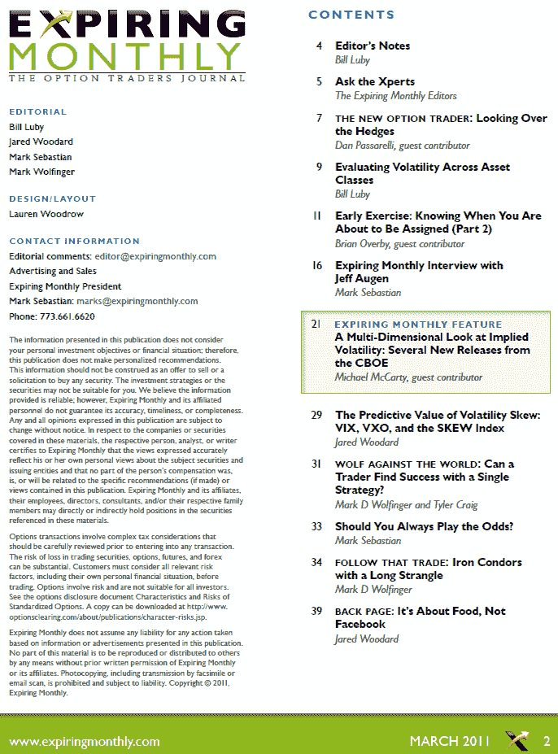

<!--yml

category: 未分类

date: 2024-05-18 16:52:54

-->

# VIX and More: Expiring Monthly March 2011 Issue Recap

> 来源：[`vixandmore.blogspot.com/2011/03/expiring-monthly-march-2011-issue-recap.html#0001-01-01`](http://vixandmore.blogspot.com/2011/03/expiring-monthly-march-2011-issue-recap.html#0001-01-01)

只是简单提醒，作为[*Expiring Monthly: The Option Traders Journal*](http://www.expiringmonthly.com/)，在期权到期后的周一出版，三月份的杂志在上周今天发布，对于订阅者来说，[下载](https://www.expiringmonthly.com/customer/account/login/)仍然可用。

请注意，Expiring Monthly 网站最近进行了改版，以提供更好的用户体验，提供[存档文章](http://www.expiringmonthly.com/archives.html)并为进一步的内容增强提供更佳的平台。尽管我可能有些偏见，但毫无疑问，这是网站前版的实质性改进。

三月份的杂志包括来自嘉宾作者 Michael McCarty 的一篇特写文章，题目是《隐含波动性的多维视角：CBOE 的几个新发布》。我的贡献是互补的：评估不同资产类别的波动性。其他值得关注的文章之一是对 Jeff Augen 的采访，他的最近出版物有助于阐明波动性的运作，特别是在期权到期末尾和收益公告时。

我还应该指出，上个月我没有提供二月刊《Expiring Monthly》的摘要。那期的特写文章是关于非方向性交易，还有一些与非方向性交易相关的额外内容，包括我为面向诊断性交易者的撰写的文章，题目是《什么是非趋势市场？》。

按照传统做法，我在下面复制了三月刊的目录，供那些对杂志了解更多感兴趣的人参考。感谢所有已经订阅的读者。对于那些对订阅信息和杂志更多细节感兴趣的读者，您可以在[`www.expiringmonthly.com/`](http://www.expiringmonthly.com/)找到所有相关信息。

相关文章：

*[来源：Expiring Monthly]*

***披露(s):*** *我是 Expiring Monthly 的创始人之一和所有者*
