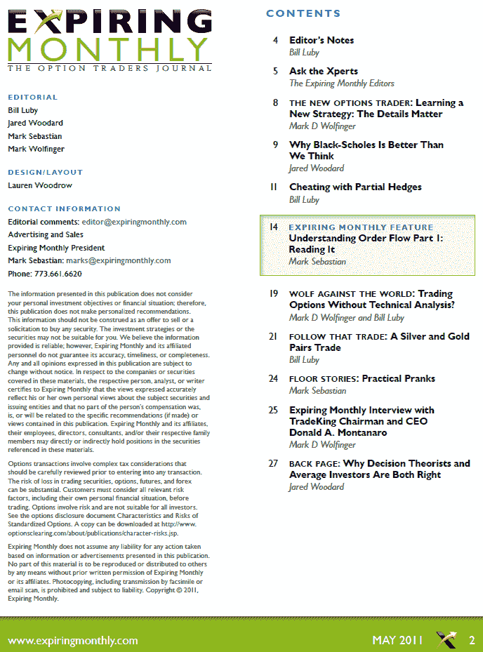

<!--yml

category: 未分类

日期：2024 年 05 月 18 日 16:50:23

-->

# VIX and More：Expiring Monthly 2011 年五月版回顾

> 来源：[`vixandmore.blogspot.com/2011/05/expiring-monthly-may-2011-issue-recap.html#0001-01-01`](http://vixandmore.blogspot.com/2011/05/expiring-monthly-may-2011-issue-recap.html#0001-01-01)

本周早些时候，[*Expiring Monthly: The Option Traders Journal*](http://www.expiringmonthly.com/) 的五月版已经发布，订阅者可以[下载](https://www.expiringmonthly.com/customer/account/login/)。

本月的特色文章 *了解订单流程，第一部分：阅读* 由 Mark Sebastian 撰写，深入探讨了大型交易对隐含波动率和偏斜度的影响等主题。Mark 将在六月版中回归，继续这个启发性系列的第二部分。

另一篇打破常规、带来不少惊喜的文章是 Jared Woodard 的 *为什么 Black-Scholes 比我们想象的更好*，评估了在对冲δ风险的背景下 Black-Scholes 模型的稳健性。

杂志中我最喜欢的部分之一是采访环节。本月 Mark Sebastian 采访了 TradeKing 的董事长兼首席执行官 Donald Montanaro。他们的对话追溯了折扣券经纪行业的历史，期权在折扣券经纪行业中的角色以及从实体店到在线期权交易的演变。

本月的期刊中，我负责三篇文章。我最喜欢的一篇文章名为 *用部分对冲欺骗*，探讨了创建定制组合对冲以最小化成本和风险，同时在最重要的地方最大化覆盖的主题。我还负责月度 *跟随交易* 专栏。本月我跟踪一笔银和金的对冲交易，结合了一些寻底特性和短期隐含波动率的风味。最后但同样重要的是，在 *Wolf Against the World* 专栏中，我与 Mark Wolfinger 对决（他的 New Options Trader 专栏对于那些新手交易期权的人来说是一个很好的资源），辩论在交易期权中使用技术分析的好处。我的论点在于使用技术分析进行头寸管理和退出。

为了保持传统，我在下面复制了五月版的目录，以便那些有兴趣了解更多杂志信息的人。感谢所有已经订阅的人。对于那些对订阅信息和有关杂志的更多详细信息感兴趣的人，您可以在（新设计的）[`www.expiringmonthly.com/`](http://www.expiringmonthly.com/) 找到所有这些以及更多信息。

相关帖子：

*[来源：Expiring Monthly]*

***声明：*** *我是 Expiring Monthly 的创始人和拥有者之一*
