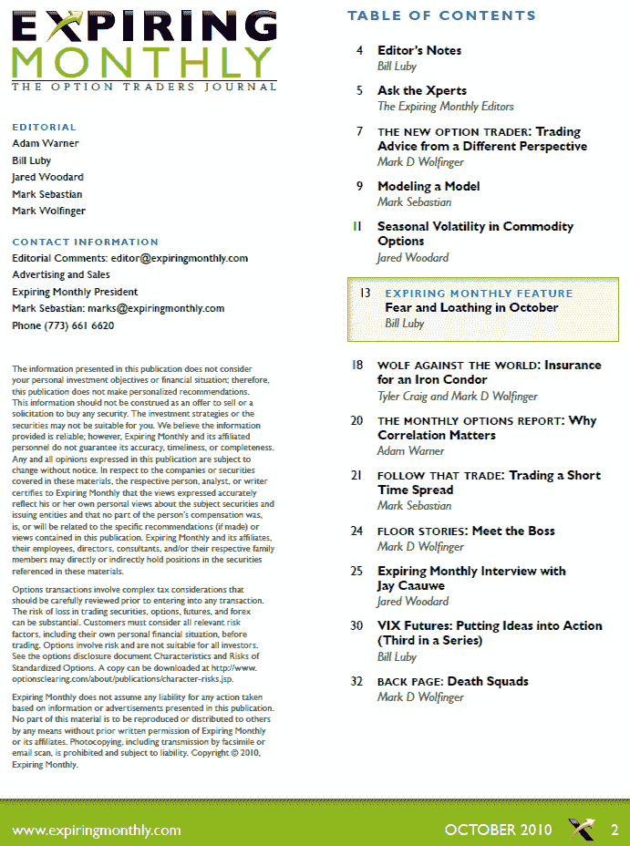

<!--yml

category: 未分类

date: 2024-05-18 17:00:54

-->

# VIX 和更多：十月号《Expiring Monthly》杂志回顾

> 来源：[`vixandmore.blogspot.com/2010/10/expiring-monthly-october-2010-issue.html#0001-01-01`](http://vixandmore.blogspot.com/2010/10/expiring-monthly-october-2010-issue.html#0001-01-01)

只是提醒一下，今天《*Expiring Monthly: The Option Traders Journal*》（[`www.expiringmonthly.com/`](http://www.expiringmonthly.com/)）的十月号已经发布，订阅者可以下载。

这月我撰写了两篇文章，我认为读者可能会特别感兴趣。第一篇是每月特色文章《十月的恐惧与憎恨》，它从 anecdotal、statistical 和 [行为金融](http://vixandmore.blogspot.com/search/label/behavioral%20finance)的角度来探讨季节性，并将九月到一月期间放在分析显微镜下。同样值得关注的是我关于[VIX 期货](http://vixandmore.blogspot.com/search/label/VIX%20futures)系列的第三篇文章。文章《VIX 期货：把想法付诸行动》提出一个六部分框架来分析 VIX 期货，并讨论了对于交易[VIX 期权](http://vixandmore.blogspot.com/search/label/VIX%20options)和[VIX ETNs](http://vixandmore.blogspot.com/search/label/VIX%20ETN)如[VXX](http://vixandmore.blogspot.com/search/label/VXX)的潜在影响。

我在下面复制了《十月号》的目录表，供那些想了解更多关于杂志的人参考。订阅信息和杂志的更多详情可在[`www.expiringmonthly.com/`](http://www.expiringmonthly.com/)找到。

Related posts:

*[来源：Expiring Monthly]*

***免责声明：*** *我是《Expiring Monthly》的创始人之一和所有者*
