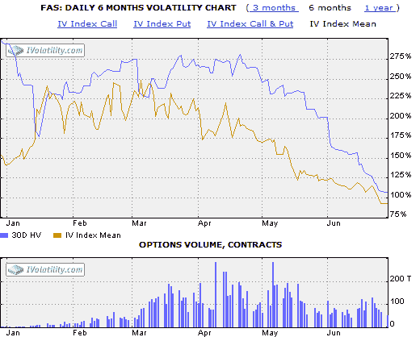
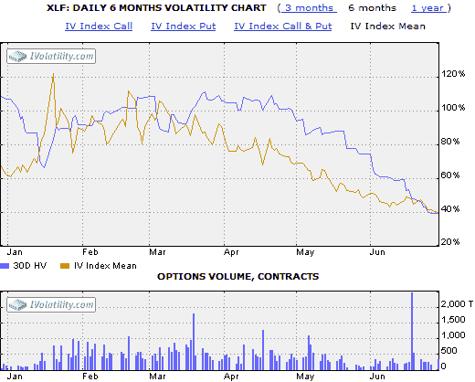

<!--yml

分类：未分类

日期：2024-05-18 17:40:41

-->

# VIX 和更多：FAS 现在是 XLF

> 来源：[`vixandmore.blogspot.com/2009/06/fas-is-now-xlf.html#0001-01-01`](http://vixandmore.blogspot.com/2009/06/fas-is-now-xlf.html#0001-01-01)

对于那些从波动性中获取乐趣的人来说，[三倍 ETFs](http://vixandmore.blogspot.com/search/label/triple%20ETFs)的出现有点像天堂的恩赐。当然，Direxion 三倍 ETFs 在 11 月初的推出恰巧与历史上最高的 VIX 读数相吻合。没有什么能比创纪录的波动性更令人兴奋了，或许除了波动性的三倍。

但是自 11 月以来已经发生了许多变化。VIX 在推出当月交易于 80s；今天它低至 25.02。此刻，VIX 正好是 11 月峰值 81.38 的三分之一。对于那些一直在出售期权的人来说，波动性滑梯的下行之旅异常有利可图。事实上，过去九个月左右收获的一些溢价可能是我们交易生涯中看到的最膨胀的。

尽管我对三倍 ETFs 的个人兴趣，但这些工具收到了混合评论，主要是因为它们作为买入并持有的投资适用性在仅一个交易日后迅速下降——问题随着波动性的增加而加剧。另一方面，最近波动性的下降抑制了杠杆 ETFs 的一些跟踪和复合错误。事实上，在当前环境中，3x 和-3x ETFs 开始与它们的历史相比显得有些温和。下面的两张图表显示了（30 天）[历史波动性](http://vixandmore.blogspot.com/search/label/historical%20volatility)（紫色线）和[隐含波动性](http://vixandmore.blogspot.com/search/label/implied%20volatility)（金色线）的最受欢迎的金融板块 ETF [XLF](http://vixandmore.blogspot.com/search/label/XLF)和震撼交易界的 3x 金融板块 ETF [FAS](http://vixandmore.blogspot.com/search/label/FAS)。虽然从这些图表中可以得出许多有趣的结论，但我想要说明的是，目前 FAS 的历史和隐含波动性（顶部图表）正 hovering around the 100 mark，这与 2 月、3 月和 4 月 XLF（底部图表）的 HV 和 IV 大致相当。换句话说，3x ETF FAS 现在的波动性或股票价格的不确定性与 4 月间的 XLF 相当。除了跟踪误差之外，FAS 现在实际上已成为 XLF 的幽灵。

来源：[iVolatility](https://wiki.example.org/source:iVolatility)
