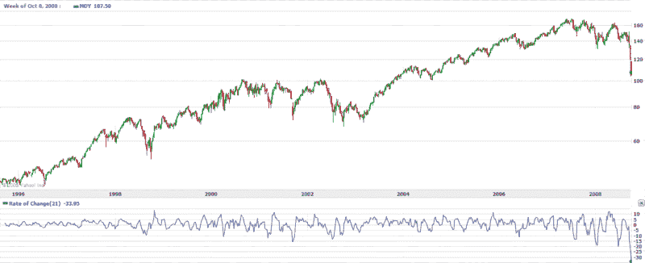

<!--yml

category: 未分类

日期：2024-05-18 18:22:40

-->

# VIX and More: Failure to Launch

> 来源：[`vixandmore.blogspot.com/2008/10/failure-to-launch.html#0001-01-01`](http://vixandmore.blogspot.com/2008/10/failure-to-launch.html#0001-01-01)

目前，我应用于各种指数和 ETF 的超卖和超买指标几乎都在高声警告“超卖”！一个特别的指数，标普 400 中等市值指数，在众多指数中脱颖而出。中等市值指数，其交易代码为[MDY](http://finance.yahoo.com/q?s=MDY)，自 1995 年以来一直存在。下图，来自雅虎，展示了该指数过去 15 年的表现。如果你正在寻找一个超卖/超买的指标，21 天的[变化率](http://vixandmore.blogspot.com/search/label/rate%20of%20change)（ROC）指标是一个不错的选择。观察 2008 年的 ROC，注意当前的读数是今年第三次创下新的负 ROC 记录。此外，当前的-33.95 读数是今年之前所见的两倍多。

在所有超卖的极端情况下，市场肯定很快会有短期反弹。事实尚未发生，这尤其有趣，意味着更多反弹的火箭燃料正在积累。然而，未能启动的状况与投资者的心理状态一样重要。只有在 VIX 接近 60 的市场中，市场才会因恐惧而无法反弹。

有时候，市场没有做的事情才真正透露了信息……

[source: Yahoo]
