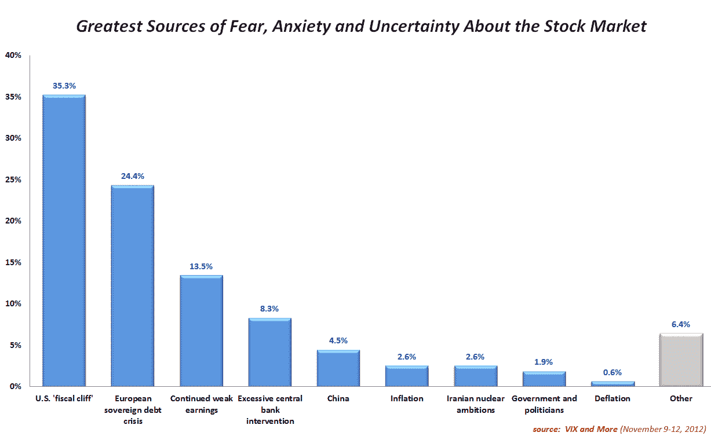
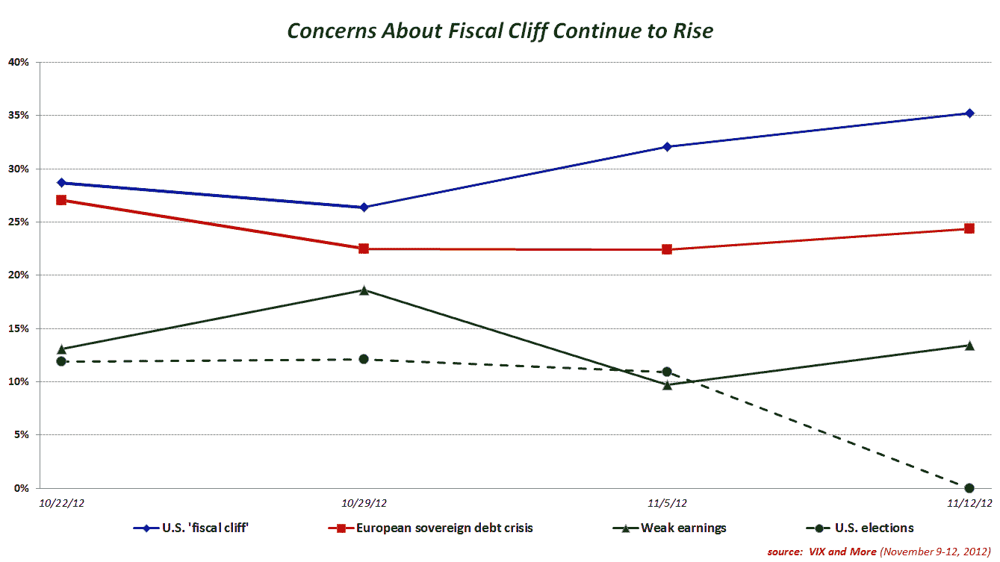

<!--yml

分类：未分类

日期：2024-05-18 16:22:53

-->

# 波动率指数(VIX)与更多：恐惧投票：财政悬崖恐惧激增，对中央银行过度干预的担忧上升

> 来源：[`vixandmore.blogspot.com/2012/11/fear-poll-fiscal-cliff-fears-spike.html#0001-01-01`](http://vixandmore.blogspot.com/2012/11/fear-poll-fiscal-cliff-fears-spike.html#0001-01-01)

连续第四周，美国[财政悬崖](http://vixandmore.blogspot.com/search/label/fiscal%20cliff)位居投资者[恐惧](http://vixandmore.blogspot.com/search/label/fear)股市问题的榜首。自从选举以来，媒体对财政悬崖的关注度不断增加，因此财政悬崖在第二名[欧洲主权债务危机](http://vixandmore.blogspot.com/search/label/European%20sovereign%20debt%20crisis)之上，高出 10.9%，这是[恐惧投票](http://vixandmore.blogspot.com/search/label/Fear%20poll)开始以来的最大差距。

对持续疲软的企业盈利保持第三位，尽管盈利季节即将结束，而对与中央银行过度干预相关问题的担忧上升至第四位。在书面投票中，最大的问题是政府和政治家的挫折，这当然与一些关于如何解决财政悬崖和欧元区问题的担忧有关。

本周再次体现了以美国为中心的视角，美国调查对象认为财政悬崖比欧洲主权债务危机更令人担忧，差距达到 16.2%，而非美国调查对象则认为这两个问题几乎同样重要，财政悬崖仅以 1.8%的优势胜出。有趣的是，这种地方主义似乎主要是美国现象，因为以色列调查对象对伊朗的担忧比非以色列调查对象少，而[德国](http://vixandmore.blogspot.com/search/label/Germany)调查对象对欧洲主权债务危机的担忧比世界其他地区少。

随着美国选举现在已经成为了过去式，美国调查对象无疑至少在某种程度上受到了媒体从选举转向财政悬崖问题的影响——这一发展我昨天在[财政悬崖担忧的上升](http://vixandmore.blogspot.com/2012/11/the-rise-of-fiscal-cliff-concerns.html)中分析过。

感谢所有参与这些投票的人，他们的参与帮助我们生成了一组非常有趣的数据。显然，我们有很多东西要学习，关于是什么驱动了恐惧，以及这些恐惧如何因地理位置、媒体和时间接近度而放大。

相关文章：

***披露(s):*** *无*
