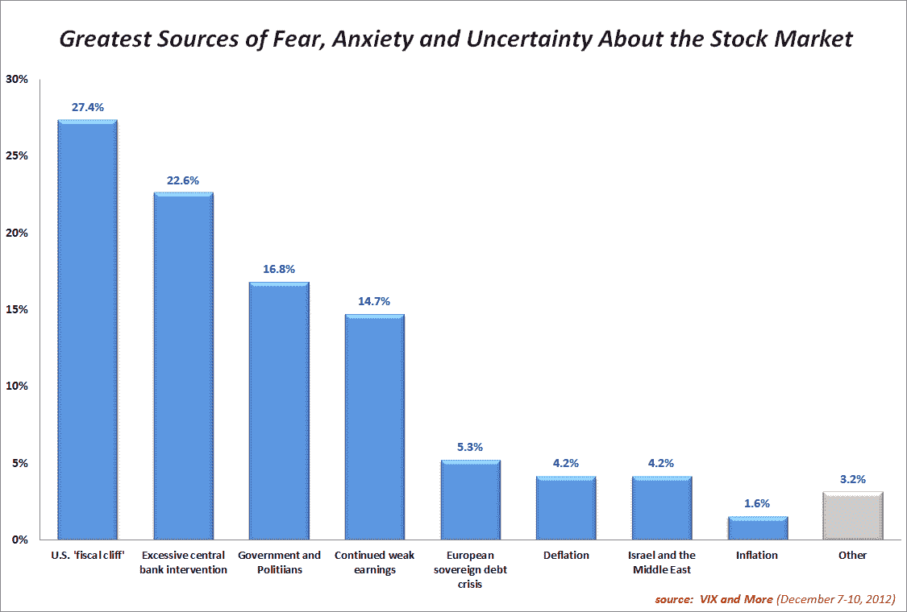
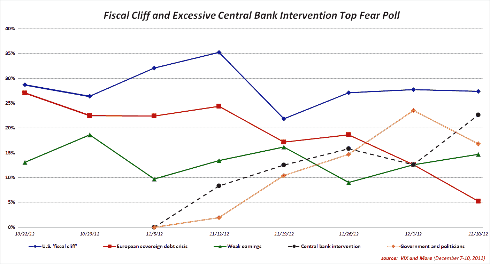

<!--yml

分类：未分类

日期：2024-05-18 16:21:25

-->

# VIX and More: 恐惧调查受访者关注财政悬崖，对欧洲金融危机持漠视态度

> 来源：[`vixandmore.blogspot.com/2012/12/fear-poll-respondents-focus-on-fiscal.html#0001-01-01`](http://vixandmore.blogspot.com/2012/12/fear-poll-respondents-focus-on-fiscal.html#0001-01-01)

连续第八周，美国[财政悬崖](http://vixandmore.blogspot.com/search/label/fiscal%20cliff)的担忧在*VIX and More*周度[恐惧调查](http://vixandmore.blogspot.com/search/label/Fear%20poll)中位居首位。与过度央行干预相关的担忧取代了与政府和政治家相关的担忧，成为第二大问题，但最有趣的发展可能是与[欧洲主权债务危机](http://vixandmore.blogspot.com/search/label/European%20sovereign%20debt%20crisis)相关的焦虑持续减轻。

从地理角度来说，本周美国和非美国受访者的意见分歧相对较低。话说回来，美国受访者将财政悬崖列为最关心的问题，而非美国受访者最担心的是央行对经济的过度干预。或许财政悬崖谈判的一部分后果是美国受访者认为政府和政治家更有可能是股市的主要威胁，比非美国受访者高出 5.6%。

有趣的是，无论是美国还是非美国受访者对欧元区问题的担忧都大大减少，只有 4.9%的美国受访者将欧元区列为头号问题，而 5.9%的非美国受访者将欧元区问题列为首要关注点。

随着[FOMC](http://vixandmore.blogspot.com/search/label/FOMC)会议定于周三结束，财政悬崖谈判接近于在国会引入年度立法的最后一天（根据 12 月 21 日休假）([December 18^(th)](http://blogs.wsj.com/marketbeat/2012/12/06/fiscal-cliff-looms-closer-than-you-think/))，而 Alcoa 计划在 1 月 8 日报告第四季度收益](http://www.alcoa.com/global/en/investment/info_page/financial_calendar.asp)，正式开启下一季度的收益报告季节，未来一个月可能会有很多事情爆发。

尽管所有这些威胁都即将来临，但 VIX 仍然保持平静，仍然处于加强 12 月是 VIX 最残酷的月份...for the VIX](http://vixandmore.blogspot.com/2011/12/december-is-cruelest-monthfor-vix.html)这一观念的位置。

再次感谢所有参与本周投票的人。

相关文章：

***披露：*** *无*
