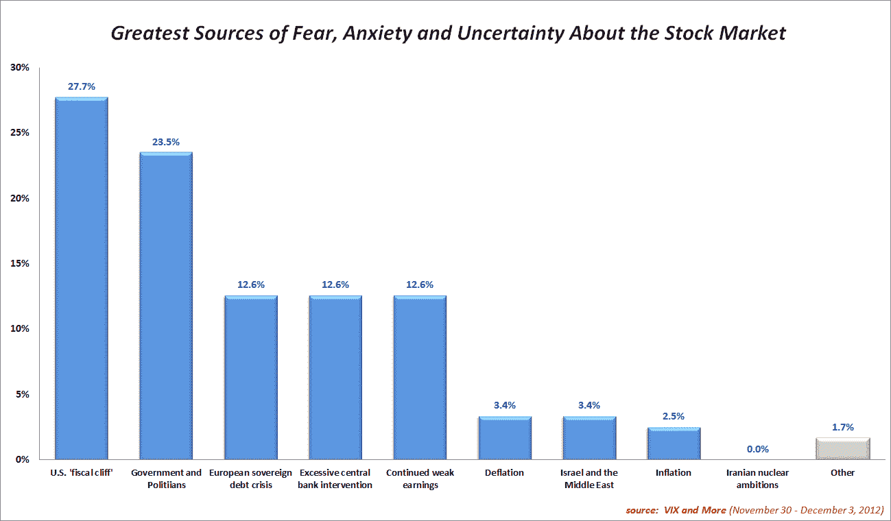
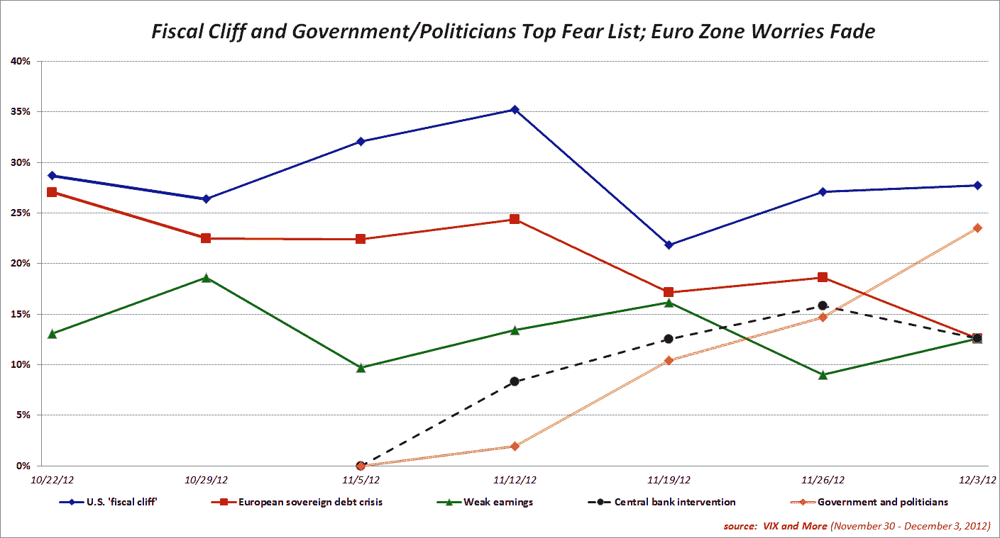

<!--yml

分类：未分类

date: 2024-05-18 16:21:49

-->

# VIX and More: 对政府和政治家的恐惧迅速升温 欧元区担忧减弱

> 来源：[`vixandmore.blogspot.com/2012/12/fear-of-governments-and-politicians.html#0001-01-01`](http://vixandmore.blogspot.com/2012/12/fear-of-governments-and-politicians.html#0001-01-01)

尽管美国[财政悬崖](http://vixandmore.blogspot.com/search/label/fiscal%20cliff)的担忧连续第七周高居*VIX and More*周度[恐惧调查](http://vixandmore.blogspot.com/search/label/Fear%20poll)首位，但大故事在于，投资者对寻找这些危机解决方案的政府和政治家的担忧比对危机本身还要强烈。

尽管这是一个全球性问题，但与政府和政治家相关的恐惧在美国最为明显，在那里，政府和政治家以 27.9%对 26.7%的优势超过了财政悬崖。在美国之外，政府和政治家的行动（或缺乏行动）只排在第四位，财政悬崖排在首位，其次是[欧洲主权债务危机](http://vixandmore.blogspot.com/search/label/European%20sovereign%20debt%20crisis)和持续的业绩不佳。

全球各地的受访者现在认为欧元区已经取得了足够的进展，将欧洲的金融危机降级为次要的担忧。

另一个值得注意的发展是财政悬崖问题中美国中心主义的突然消失。在过去的六周里，美国 based 的受访者比非美国受访者更有 13.1% 的可能性将财政悬崖列为他们的首要担忧。这是非美国受访者首次将财政悬崖视为比美国同行更大的恐惧。当然，如果把美国对政府和政治家的焦虑大部分归因于财政悬崖，那么这次调查的结果可能更多地说明不同群体如何看待财政悬崖问题的根源，而不是其他任何东西。

正如上周所提到的，如果把财政悬崖、欧元区、中央银行和政府+政治家的回应加起来，可以将大约 75-80%的投资者恐惧归咎于中央银行和政府等机构，而财政悬崖和欧元区金融危机仅仅是更大问题的症状。

再次感谢所有参与这项周度调查的人。

相关帖子：

***披露(s)：*** *无*
