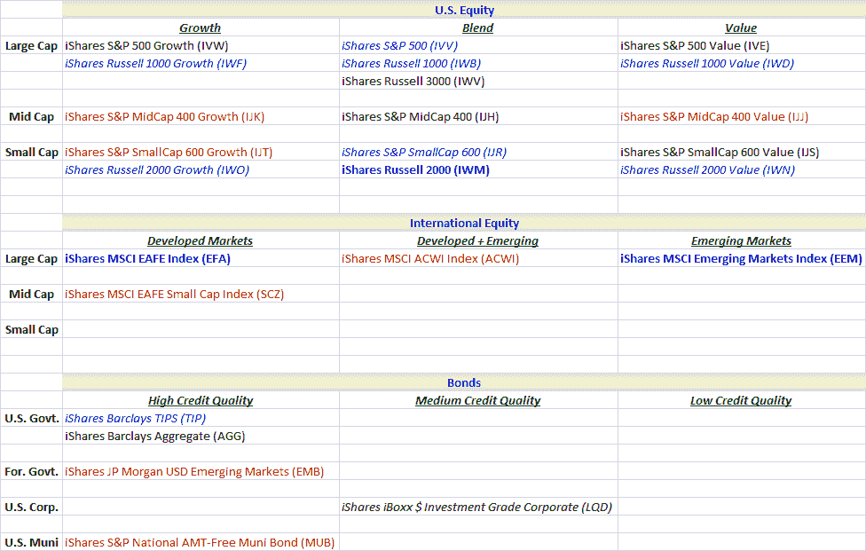

<!--yml

分类：未分类

日期：2024-05-18 17:16:20

-->

# VIX and More: 富达免佣交易 25 只 iShares ETF

> 来源：[`vixandmore.blogspot.com/2010/02/fidelity-offering-25-ishares-etfs.html#0001-01-01`](http://vixandmore.blogspot.com/2010/02/fidelity-offering-25-ishares-etfs.html#0001-01-01)

共同基金巨头富达在 ETF 革命中基本上被绕过，但当公司宣布从今天开始 25 只 iShares ETF 将可以在富达平台上免佣交易时，公司发出了一记重要的竞争信号。

这 25 只 ETF 包括 16 只美国股票指数 ETF、4 只基于国际股票指数的 ETF 和 5 只债券 ETF，涵盖了广泛的发行人、地理位置和信用质量。下表试图对这些免佣 ETF 进行详细分类，以帮助那些对其中一部分或全部 ETF 不太了解的投资者更好地了解它们的特性。

富达 / iShares 25 中包括了我用粗体蓝色字体突出显示的三个大户。这些 ETF 每天平均交易 2000 万股以上，并且有高流动性的期权市场。事实上，[EEM](http://vixandmore.blogspot.com/search/label/EEM) 和 [IWM](http://vixandmore.blogspot.com/search/label/IWM) 是最活跃交易的五个 ETF 之一。除了这三个大户外，我还用斜体蓝色字体突出显示了此组中其他八只 ETF，每天平均交易量至少为 100 万股。下一个最流动的 ETF 为黑色字体。最后，我将红色字体保留给了七只没有关联期权的 ETF。毫不奇怪，这些底层 ETF 也是该组中流动性最差的 ETF。

就分组而言，我将这些 ETF 分为三个高级别类别：美国股票；国际股票；以及债券类别。对于美国股票 ETF，我进一步将这些 ETF 划分为 [晨星风格箱](http://www.morningstar.com/InvGlossary/morningstar_style_box.aspx) 类别。对于国际股票 ETF，我根据市值和发达 / 新兴市场的曝光来进行划分。最后，对于债券 ETF，这些是根据发行人和信用质量进行拆分的。

由于佣金成本的原因而远离交易频繁策略的投资者现在可能希望在富达 / iShares 免佣 ETF 的背景下重新考虑其中一些想法。至于期权交易者，某些股票期权策略，如 [买入-写出](http://vixandmore.blogspot.com/search/label/buy-write) 现在也可能值得再次关注。

对于这些主题的相关帖子，读者可以参考：

***披露：*** *无*
