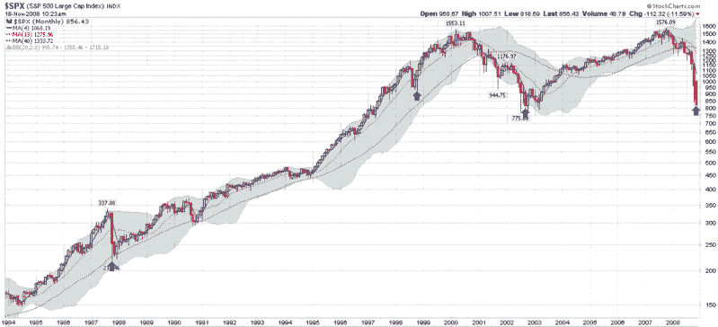

<!--yml

分类：未分类

日期：2024-05-18 18:15:49

-->

# 维克斯和更多：50 日历史波动率是否正在触顶？

> 来源：[`vixandmore.blogspot.com/2008/11/fifty-day-historical-volatility-rolling.html#0001-01-01`](http://vixandmore.blogspot.com/2008/11/fifty-day-historical-volatility-rolling.html#0001-01-01)

在过去两个月左右的时间里，昨天发生了一件非常罕见的事情：标普 500 指数的 50 日历史波动率（HV）下降了。尽管这个事实本身可能不足以成为与“TARPland”的最新篇章并列的头条新闻，但历史波动率在标普 500 指数中可能刚刚触顶。

实际上，标普 500 指数的 10 日历史波动率在 10 月 22 日达到峰值，随后 20 日和 30 日的历史波动率分别于 11 月 5 日和 11 月 7 日达到顶峰。现在说 50 日历史波动率不会超过周五的高点还为时尚早，但这种可能性较大，因为距离 9 月 15 日由雷曼兄弟引发的抛售触顶仅剩几天时间，50 日回望窗口即将关闭。

现在我敢肯定这种波动性琐事不太可能激发读者的兴趣，所以我下面附上了一个图表，显示了标普 500 指数（SPX）历史上 50 日历史波动率达到或高于 30 的水平的三次峰值。尽管之前三次（由蓝色箭头标记）都证明是极好的买入机会，但最近寻找历史相似之处来帮助解释当前市场状况的方法充满了危险。

思考历史波动率触顶的更好方式是，就像 VIX 一样，历史波动率是市场不确定性和情绪因素的晴雨表。随着这些读数开始从近期高点回撤，各种投资理念的投资者更有可能进入市场。

来源：[StockCharts]
