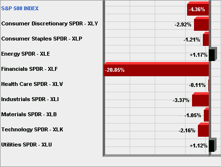

<!--yml

分类：未分类

日期：2024-05-18 18:05:08

-->

# VIX 以及更多：过去一个月标普 500 指数下跌的一半由金融股造成

> 来源：[`vixandmore.blogspot.com/2009/01/financials-account-for-half-of-loss-in.html#0001-01-01`](http://vixandmore.blogspot.com/2009/01/financials-account-for-half-of-loss-in.html#0001-01-01)

虽然这对持有银行股票的人来说并不奇怪，但我发现有趣的是，过去一个月标普 500 指数的一半损失可以归因于金融板块 ([XLF](http://vixandmore.blogspot.com/search/label/XLF))。

下图表显示，在过去的一个月里，金融股下跌了近 21%，而其他主要行业板块则接近盈亏平衡。如果从方程中移除金融股，只有工业股 ([XLI](http://vixandmore.blogspot.com/search/label/XLI)) 在此期间下跌了 3%。

市场目前并不健康，但金融股对其他板块造成的附带损害可能已经达到顶峰。这并不是说没有金融股市场就能反弹，但金融板块越来越难以拖累整个市场。

*[来源：美国运通，VIX 以及更多]*
