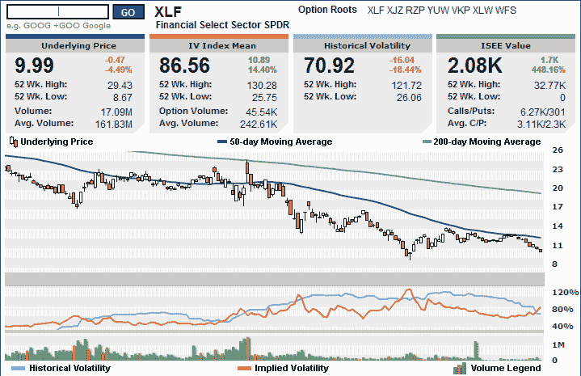

<!--yml

category: 未分类

date: 2024-05-18 18:05:52

-->

# VIX 和更多：金融业 SPDR（XLF）跌破 10.00

> 来源：[`vixandmore.blogspot.com/2009/01/financials-spdr-xlf-drops-below-1000.html#0001-01-01`](http://vixandmore.blogspot.com/2009/01/financials-spdr-xlf-drops-below-1000.html#0001-01-01)

[XLF](http://vixandmore.blogspot.com/search/label/XLF)，这个被广泛关注的金融行业 ETF，几分钟前首次跌破 10.00，这是其交易历史上的第三次。

不仅金融业是目前 2009 年表现最弱的行业，而且其持续的疲软将只会引发更多关于金融体系结构完整性的担忧。

考虑到金融业的疲软，我很惊讶股市目前没有更低，而 VIX 指数更高。

*[source: 国际证券交易所]*
