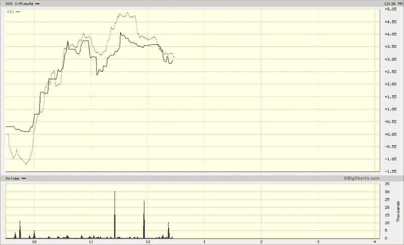
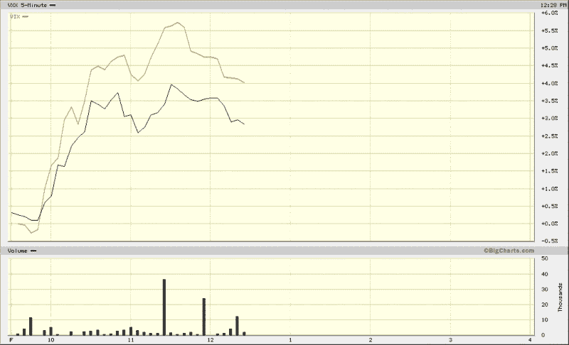

<!--yml

分类：未分类

日期：2024-05-18 18:02:55

-->

# VIX and More: 首次比较 VIX 和 VXX 的走势

> 来源：[`vixandmore.blogspot.com/2009/01/first-comparison-of-vix-and-vxx.html#0001-01-01`](http://vixandmore.blogspot.com/2009/01/first-comparison-of-vix-and-vxx.html#0001-01-01)

要绘制 VIX 和[VXX](http://vixandmore.blogspot.com/search/label/VXX)之间有意义比较的数据，还需要几天时间。[VIX ETN](http://vixandmore.blogspot.com/search/label/VIX%20ETN)是一种新的[VIX ETN](http://vixandmore.blogspot.com/search/label/VIX%20ETN)。无论好坏，这都不会阻止我对 VXX 起步表现进行评论。

我的第一个观察是关于成交量。自 VXX 推出以来前三个小时，有 143,600 股成交量，看起来这个产品投资者会很喜欢。不仅成交量高，而且相对稳定，途中有一些峰值。

关于 VXX 追踪 VIX 的紧密程度，下面来自 BigCharts 的一分钟图表（顶部）提供了两者之间关系的第一个图形表示。平均而言，VXX（黑色线条）的波动性略低于 VIX（金色线条），但有些时期 VXX 的走势比 VIX 更为明确。

我在图表的底部添加了一个五分钟的走势图，以平滑一分钟的图表中固有的某些噪音。在这张图表中，趋势和相对运动更容易让眼睛消化，并且显示了今天交易前三个小时 VXX 的波动性明显低于 VIX。

在没有统计分析（下周即将推出）的情况下，我会说，就今天的数据而言，VXX 是 VIX 的一个优秀但略显迟缓（如预期中那样）的代理。综合考虑，它已经是市场上最好的交易工具，用于近似现金/即期 VIX。

来源：[BigCharts]

****披露：**** *在撰写本文时持有 VXX.**
