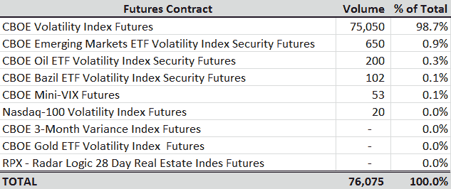

<!--yml

分类：未分类

日期：2024-05-18 16:29:50

-->

# VIX and More: 纳斯达克 100 波动指数（VXN）期货的首日交易

> 来源：[`vixandmore.blogspot.com/2012/05/first-day-of-trading-in-nasdaq-100.html#0001-01-01`](http://vixandmore.blogspot.com/2012/05/first-day-of-trading-in-nasdaq-100.html#0001-01-01)

你真的需要一张得分卡来跟上 CBOE 的新产品发布。今天可能是一个重要日子，随着纳斯达克 100 波动指数期货的推出，我们大多数人简单地称其为[VXN](http://vixandmore.blogspot.com/search/label/VXN)或 Vixen。

正如下面表格所示，VIX 继续占据了 CBOE 期货交易所（[CFE](http://vixandmore.blogspot.com/search/label/CFE)）的波动指数期货的大约 99%。今天 VXN 期货（[VN](http://vixandmore.blogspot.com/search/label/VN)）在其开盘日交易了 20 份合约。尽管 CBOE 新兴市场 ETF 波动指数（[VXEEM](http://vixandmore.blogspot.com/search/label/VXEEM)）的期货目前在 CFE 排名第二，但 VXN 期货无疑具有巨大潜力，苹果（[AAPL](http://vixandmore.blogspot.com/search/label/AAPL)）、脸书（[FB](http://vixandmore.blogspot.com/search/label/FB)）和谷歌（[GOOG](http://vixandmore.blogspot.com/search/label/GOOG)）等科技股的加入使得这一证券更加丰富。

相关信息，对于那些可能感兴趣的人来说，我撰写了当前版《Expiring Monthly》杂志的专题文章《波动性巨型复合体的扩张》。这篇文章记录了波动指数的历史，并探讨了 CBOE 如何最近开始积极扩大波动指数的范围，并将其转化为期货、期权和交易所交易产品的平台。

相关文章：

**

*[来源(s): CBOE 期货交易所]*

***披露(s):*** *CBOE 是 VIX and More 的广告商**
