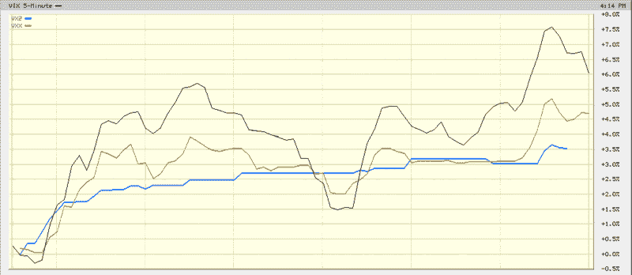

<!--yml

category: 未分类

date: 2024-05-18 18:02:44

-->

# VIX and More：VXX 和 VXZ 交易的首日取得成功

> 来源：[`vixandmore.blogspot.com/2009/01/first-day-of-trading-in-vxx-and-vxz.html#0001-01-01`](http://vixandmore.blogspot.com/2009/01/first-day-of-trading-in-vxx-and-vxz.html#0001-01-01)

[VIX ETN](http://vixandmore.blogspot.com/search/label/VIX%20ETN)s 的首日交易是一次毫无保留的成功。iPath S&P 500 短期 VIX 期货（1 个月）ETN（[VXX](http://vixandmore.blogspot.com/search/label/VXX)）的成交量达到 215,700 股，而其 5 个月期的对应品（[VXZ](http://vixandmore.blogspot.com/search/label/VXX)）交易了 73,900 股。

将这些数字放在一个透视图中，比如说，戴瑞雄三倍 ETFs 的首日交易量（2008 年 11 月初）分别为 19,063（[BGU](http://vixandmore.blogspot.com/search/label/BGU)）、30,783（[TNA](http://vixandmore.blogspot.com/search/label/TNA)）和 10,313（[FAS](http://vixandmore.blogspot.com/search/label/FAS)）。少于三个月后，这三个 ETFs 中**最不受欢迎的**每天交易量现在都一直超过 1000 万股。

预测[戴瑞雄 ETFs 成功](http://vixandmore.blogspot.com/2008/11/prediction-direxion-triple-etfs-will.html)对我来说看起来很容易，但 VIX 和 VIX ETN 的特殊性意味着即使它们的首日表现更加出色，也更难以保证今天的新市场参与者取得超级明星的地位。比如，投资者可能需要一段时间来决定新的 VIX ETN 是否更适合日内交易、对冲、套利还是其他策略，但很明显 VXX 和 VXZ 有可能成为 ETF/ETN 交易工具的顶级产品之一。

在相对价格变动方面，下图突出显示了最波动的现金/现货 VIX（黑线）、较不波动的 VXX（金线）和相对较低的 VXZ（蓝线）之间的差异。在一天的不同时间，VXX 的移动速度约为 VIX 速度的 50-80%。毫不奇怪，更长期的 VXZ 捕捉到了波动率的总体上升趋势，但不愿扭转方向。

要从一天的数据中得出有意义的结论总是很困难，但至少现在有了一些 VIX ETN 的数据点可以讨论，我们至少可以开始朝着统计意义上显著的宇宙的方向进行外推。

*[来源：BigCharts]*
