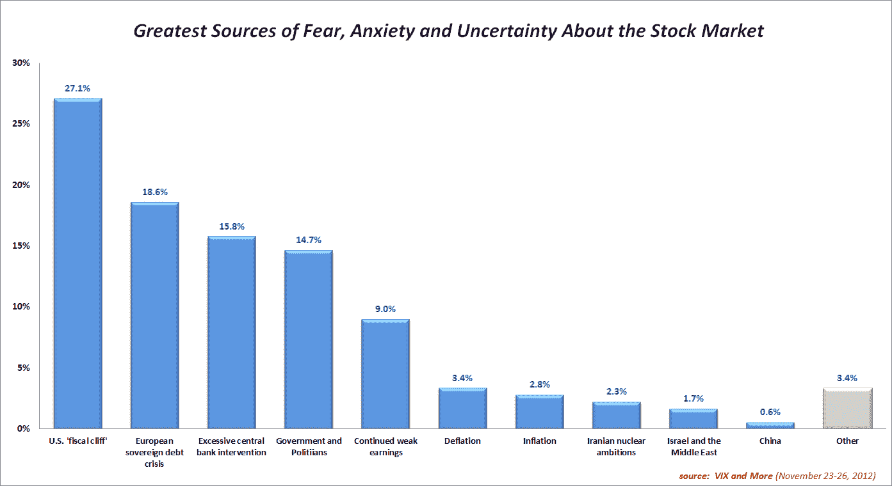
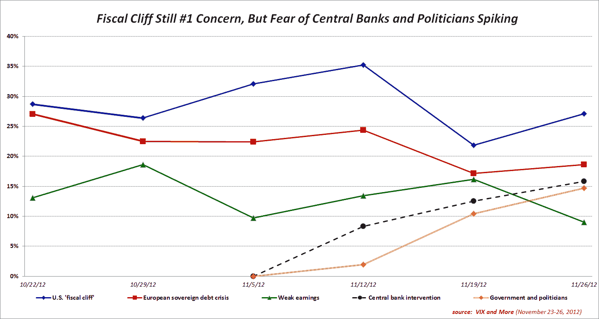

<!--yml

分类：未分类

日期：2024-05-18 16:22:28

→

# VIX 和更多：财政悬崖担忧居恐惧调查首位，但央行和政客被视为关键系统性威胁。

> 来源：[`vixandmore.blogspot.com/2012/11/fiscal-cliff-concerns-top-fear-poll-but.html#0001-01-01`](http://vixandmore.blogspot.com/2012/11/fiscal-cliff-concerns-top-fear-poll-but.html#0001-01-01)

对于美国[财政悬崖](http://vixandmore.blogspot.com/search/label/fiscal%20cliff)的担忧继续位居*VIX 和更多*周度[恐惧调查](http://vixandmore.blogspot.com/search/label/Fear%20poll)的首位，而投资者对于疲弱收益、以色列和[中国](http://vixandmore.blogspot.com/search/label/China)的焦虑都大幅下降。

过去两周投资者担忧情绪最大的变化是对央行和政府在经济事务中角色的不信任趋势日益增长。对于央行行长和政治人物的担忧足够严重，在所有受访者中排在第 3 和第 4 位，在美国甚至更高，在那里政府和政治人物成为第 2 大担忧，而过度央行干预的担忧排名第 3。

如果把财政悬崖和[欧洲主权债务危机](http://vixandmore.blogspot.com/search/label/European%20sovereign%20debt%20crisis)（在全球范围内仍然排名第 2）看作是由央行、政府和政治人物造成或加剧的情况，那么把所有投资者的[恐惧](http://vixandmore.blogspot.com/search/label/fear)中的*75-80%*归咎于央行和政府并不困难。

正如上周所提到的，持续的美洲中心偏见显示出没有减退的迹象。例如，本周有 12.4%的美国受访者将财政悬崖列为头号担忧，超过欧洲主权债务危机。然而，对于非美国受访者来说，财政悬崖仅比欧洲主权债务危机高出 2.8%。

再次感谢所有参与这项周度调查的人。

相关帖子：

***披露(s):*** *无*
