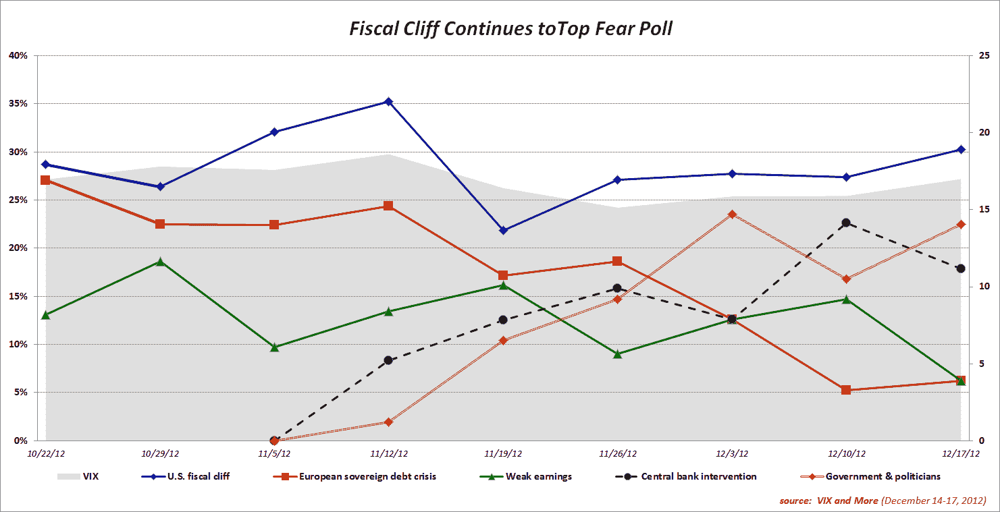
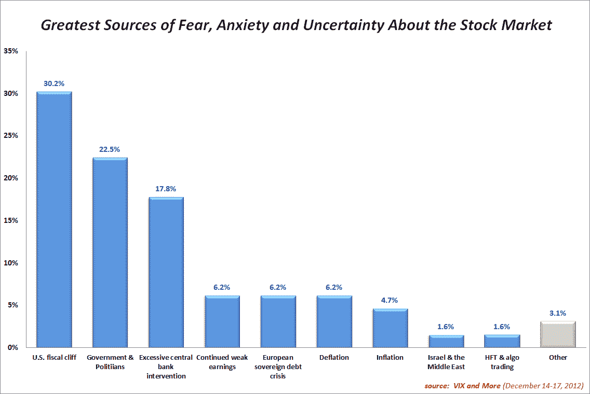

<!--yml

分类：未分类

日期：2024-05-18 16:21:03

-->

# VIX and More: 财政悬崖继续位居恐惧投票之首

> 来源：[`vixandmore.blogspot.com/2012/12/fiscal-cliff-continues-to-top-fear-poll.html#0001-01-01`](http://vixandmore.blogspot.com/2012/12/fiscal-cliff-continues-to-top-fear-poll.html#0001-01-01)

在一周内，美国[财政悬崖](http://vixandmore.blogspot.com/search/label/fiscal%20cliff)谈判似乎没有取得什么进展，投资者继续将财政悬崖列为*VIX 和更多* 每周[恐惧投票](http://vixandmore.blogspot.com/search/label/Fear%20poll)中股市最大的威胁。[政府和政治家相关的担忧](http://vixandmore.blogspot.com/search/label/fear)击败了关于过度中央银行干预的担忧，成为第二大问题，而与[欧洲主权债务危机](http://vixandmore.blogspot.com/search/label/European%20sovereign%20debt%20crisis)相关的焦虑则与第四名并列。

这次投票是九周以来美国和非美国受访者第三次在顶级威胁上达成一致，也是第一次将顶级两个威胁排在相同顺序。事实上，对威胁的顺序达成一致的看法在前三个威胁中都是相同的。

作为一个迹象，地理接近偏见似乎已经减弱，美国受访者比非美国受访者（其中大多数是欧洲人）更重视欧洲主权债务危机，而非美国受访者更重视财政悬崖。在过去的几周里，已经有强烈的地区近视证据。

另一个值得注意的事项是，上周美联储政策发生了戏剧性的变化，从时间表转向了针对失业率和通胀率的目标，人们可能预计本周对通胀或通缩的担忧会更多。相反，本周对通胀和通缩的担忧显著上升，特别是来自美国受访者的担忧。

如果在未来几周内就财政悬崖问题达成协议，人们合理地会问会发生什么。达成协议会对与政府和政治家相关的担忧产生重大影响吗？或者与机构相关的担忧会持续存在，并证明比特定事件的担忧更重要？最后，如果财政悬崖的担忧随着协议的达成而消失，新的担忧会冒出来取代它的位置吗？本周，一些受访者提交了与[高频交易](http://vixandmore.blogspot.com/search/label/high%20frequency%20trading)（HFT）和算法交易相关的书面投票。这会是接下来困扰股市的下一个担忧吗？

再次感谢所有参与这项每周投票的人。

相关文章：

***披露(s):*** *无*
