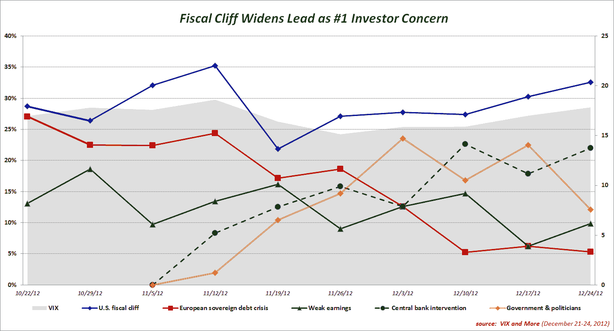

<!--yml

category: 未分类

date: 2024-05-18 16:20:19

-->

# VIX and More: 财政悬崖扩大领先地位，成为投资者首要担忧

> 来源：[`vixandmore.blogspot.com/2012/12/fiscal-cliff-widens-lead-as-1-investor.html#0001-01-01`](http://vixandmore.blogspot.com/2012/12/fiscal-cliff-widens-lead-as-1-investor.html#0001-01-01)

延续近期趋势，美国[财政悬崖](http://vixandmore.blogspot.com/search/label/fiscal%20cliff)在*VIX and More*每周[恐惧调查](http://vixandmore.blogspot.com/search/label/Fear%20poll)中连续第十周成为投资者对股市构成威胁的最大担忧。与过度中央银行干预相关的担忧排在第二位，而对政府和政治家的更普遍担忧则排在第三位。

本周财政悬崖与第二名问题的差距为 10.6%，为六周来最大，也是自调查创立十周来的第二大差距。

连续第二周，受访者之间的地理差异相对较小，美国与非美国受访者之间只有微小的差异。在过去三个月里，将美国受访者与非美国受访者分开的关于财政悬崖与[欧洲主权债务危机](http://vixandmore.blogspot.com/search/label/European%20sovereign%20debt%20crisis)相对重要性的区域短视似乎在过去两周里随着对欧元区未来的广泛担忧的减轻而消失了。

再次感谢所有参与这项每周调查的人。

*最后但同样重要的是，祝大家圣诞快乐，节日愉快，愿您在 2013 年里生活幸福、健康、快乐且盈利！*

Related posts:

***披露(s):*** *无*
