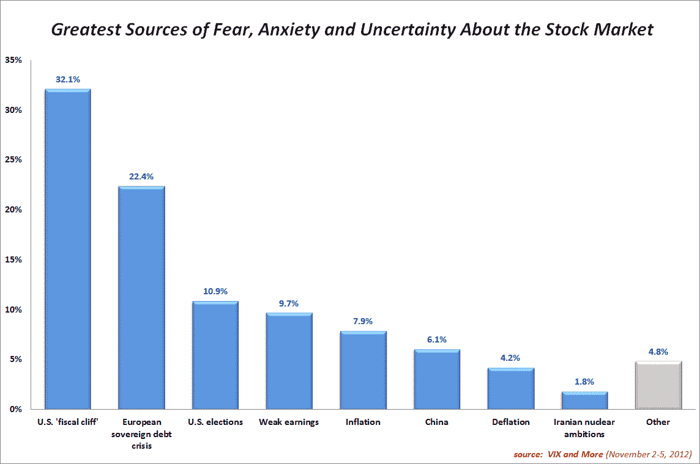
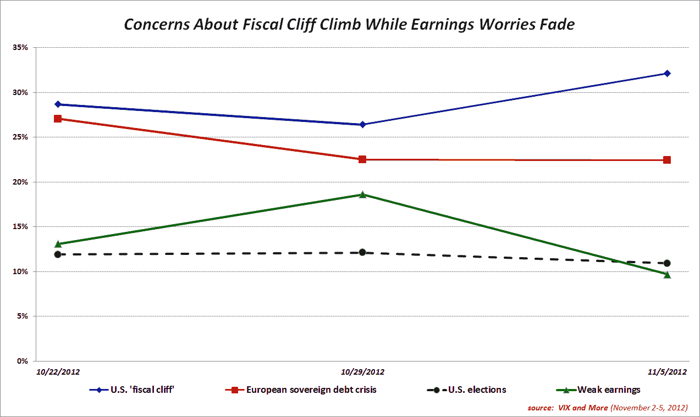

<!--yml

category: 未分类

date: 2024-05-18 16:23:37

-->

# VIX and More: Fiscal Cliff Worries Grow As Election Nears

> 来源：[`vixandmore.blogspot.com/2012/11/fiscal-cliff-worries-grow-as-election.html#0001-01-01`](http://vixandmore.blogspot.com/2012/11/fiscal-cliff-worries-grow-as-election.html#0001-01-01)

对于美国[财政悬崖](http://vixandmore.blogspot.com/search/label/fiscal%20cliff)结果的担忧第三次出现在投资者对股市[恐惧](http://vixandmore.blogspot.com/search/label/fear)的列表首位，领先于排名第二的[欧洲主权债务危机](http://vixandmore.blogspot.com/search/label/European%20sovereign%20debt%20crisis)和排名第三的美国选举，后者险胜业绩疲软。

此次调查 65%的回应来自美国选民，因此调查结果再次倾向于以美国为中心的视角。进行这项调查的三周后，似乎地理位置和时间上的接近对受访者产生了强烈影响。连续第三周，美国受访者对其国内事件更加担忧。例如，财政悬崖在美国的投票中领先于欧洲主权债务危机 14.8%，而非美国受访者将这两个问题并列第一。同样，13.9%的美国受访者将美国选举列为他们最大的担忧，而只有 5.3%的非美国受访者将美国选举列为首选。

毫不意外，对于一个疲弱财报季的担忧在过去的一周里急剧下降，从 18.6%降至 9.7%，因为大多数关键的财报报告已经发布，且如下图所示，产生实质性惊喜的可能性已经大幅降低。

随着明天大多数选举不确定性即将得到解决，我预计财政悬崖和欧洲主权债务危机将在下周再次脱离行列。这将给 VIX 带来上升还是下降的压力还有待观察。

Related posts:

***Disclosure(s):*** *none*
