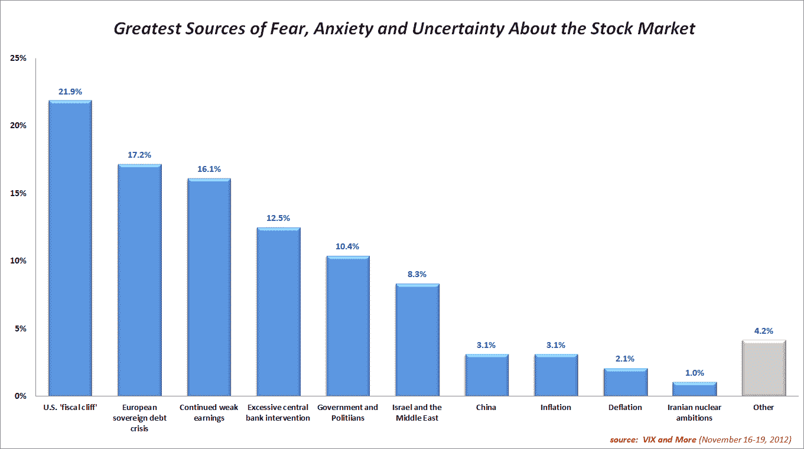
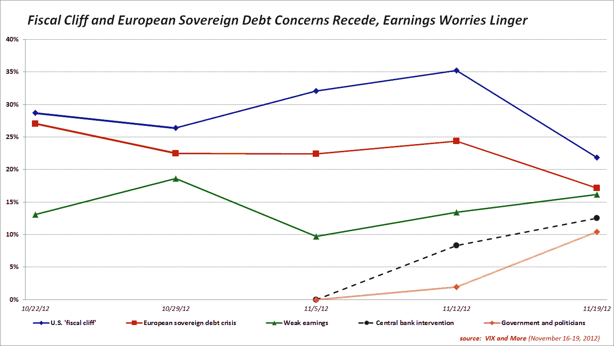

<!--yml

分类：未分类

日期：2024-05-18 16:22:38

-->

# VIX and More: 财政悬崖和欧洲主权债务担忧减轻，业绩忧虑挥之不去

> 来源：[`vixandmore.blogspot.com/2012/11/fiscal-cliff-and-european-sovereign.html#0001-01-01`](http://vixandmore.blogspot.com/2012/11/fiscal-cliff-and-european-sovereign.html#0001-01-01)

对于美国[财政悬崖](http://vixandmore.blogspot.com/search/label/fiscal%20cliff)和[欧洲主权债务危机](http://vixandmore.blogspot.com/search/label/European%20sovereign%20debt%20crisis)的担忧在过去的一周内都有所下降，因为股市努力确立底部，在标普 500 指数下跌 8.9%之后，根据*VIX and More*周度[恐惧调查](http://vixandmore.blogspot.com/search/label/Fear%20poll)。

尽管业绩报告季即将结束，投资者继续对未来的弱势业绩和指导表示担忧，业绩忧虑在调查中排名第三。

投资者情绪最大的变化是对中央银行和政府等机构的日益不满，以及他们担心这些机构在经济事务中的介入会产生更多的负面影响而非正面影响。[恐惧](http://vixandmore.blogspot.com/search/label/fear)关于中央银行过度干预以及更广泛地关注政府和政治家的角色两周前还几乎不存在。综合来看，对这两个有影响力的政策制定机构的信任缺失现在与财政悬崖或欧元区问题的担忧一样大，下面的图表显示了这一点。

持续的美洲中心偏见仍然明显。例如，本周，美国受访者中有 8.5%更多的人将财政悬崖列为头号担忧，而非美国受访者中，欧洲主权债务危机的担忧超过了财政悬崖，比例为 3.2%。

从地理角度值得注意的是，美国受访者比非美国受访者更有 1.8%的可能将过度中央银行干预列为他们的首要担忧，并有 5.9%更倾向于将政府和政治家视为他们最大的担忧。除了更加重视欧洲主权债务危机外，非美国受访者还对中国和通缩表示了更多的担忧。

再次感谢所有参与这项周度调查的人。

相关文章：

***披露(s):*** *无*
