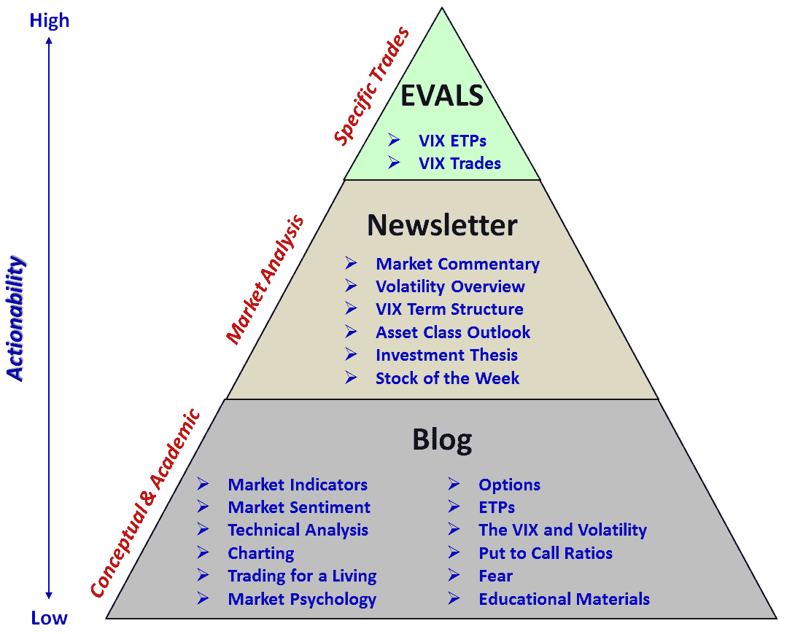

<!--yml

category: 未分类

date: 2024-05-18 16:43:20

-->

# VIX and More: 五年的 VIX 和更多内容

> 来源：[`vixandmore.blogspot.com/2012/01/five-years-of-vix-and-more.html#0001-01-01`](http://vixandmore.blogspot.com/2012/01/five-years-of-vix-and-more.html#0001-01-01)

一周前，我的第一篇*VIX and More*文章发布了五周年。由于这个纪念日恰好在我的[2011 年度热门文章](http://vixandmore.blogspot.com/2011/12/top-posts-of-2011.html)之后，我觉得再次回顾博客可能有些过多。经过一周的思考，我现在确信[第 1000 篇文章](http://vixandmore.blogspot.com/2009/06/1000th-post.html)（至少现在）最好保持不变，作为博客上代表这些想法的 definitive history 和新读者的良好参考。另一个值得突出的链接是希望不言而喻的[月度最佳文章：VIX and More 的非正式历史](http://vixandmore.blogspot.com/2009/10/post-of-month-informal-history-of-vix.html)。最后但并非最不重要的是，对于那些对档案中的最佳文章感兴趣的人来说，那些带有[名人堂](http://vixandmore.blogspot.com/search/label/hall%20of%20fame)标签的几篇文章是我个人最喜欢的。

为了纪念五周年，我选择突出博客成立以来阅读量最高的十篇文章，并对每篇文章进行一些评论。

1.  [关于 VIX 的十件事每个人都应该知道](http://vixandmore.blogspot.com/2008/04/ten-things-everyone-should-know-about.html) – 如果在我的博客上有一篇文章每个人都受益匪浅，而且新读者可能会希望从这篇文章开始阅读，那就是这篇文章。我上一次更新这篇文章的内容是在 2010 年，我肯定会很快再次修订它。

1.  [如何交易 VIX](http://vixandmore.blogspot.com/2009/08/how-to-trade-vix.html) – 这篇文章对如何交易 VIX 的基本解释可能受益于一个在 Google 搜索中定位良好的标题。关于如何交易 VIX 有很多相关文章（其中一些是原文中的链接），但在这里我应该重新审视这个主题，并提供更全面的信息。

1.  [VXX 计算、VIX 期货和时间衰减](http://vixandmore.blogspot.com/2009/05/vxx-calculations-vix-futures-and-time.html) – 我觉得很有趣的是，一篇在当年未能进入前十的帖子（2009 年）现在却成了所有时间里的前三。我相信这是第一个详细解释了[VIX 期货](http://vixandmore.blogspot.com/search/label/VIX%20futures) [滚动收益率](http://vixandmore.blogspot.com/search/label/roll%20yield)和涉及的数学问题，持续的[正向市场](http://vixandmore.blogspot.com/search/label/contango)以及[VXX](http://vixandmore.blogspot.com/search/label/VXX)的价格衰减。由于许多交易员已经从事 VXX 和相关产品的交易，这篇文章变成了一个非常有价值的教学资源，并且在三年后仍然经常被引用。

1.  [为什么 VXX 不适合短期或长期投资](http://vixandmore.blogspot.com/2009/10/why-vxx-is-not-good-short-term-or-long.html) – 在上面的帖子几个月后写的这篇文章，扩展了我之前阐述的一些想法，投资者们发现这些想法无论在哪个交易时段都有帮助。

1.  [预测：Direxion 三倍 ETFs 将改变日交易](http://vixandmore.blogspot.com/2008/11/prediction-direxion-triple-etfs-will.html) – 当我开始这个博客时，我试图关注教育材料，而不是谈论我的交易或我对市场的预期。然而，偶尔也有一些我认为很可能发生的事情与传统思维相悖。这个三倍 ETF 的预测就是其中之一，也帮助吸引了人们对这些新产品关注的注意力。

1.  [本周图表：近期成交量底部是否预示着股价下跌？](http://vixandmore.blogspot.com/2009/06/chart-of-week-might-recent-volume.html) – 我很惊讶地发现这个帖子出现在最后，因为其中的分析可能不是我最好的思考。我相信当时的情况是，投资者们开始担心股票从 2009 年 3 月的低点强劲反弹后可能会很快失去动力。结果证明，在这篇文章发表后，股市下跌了大约两周，回落到 SPX 869，然后又恢复了看涨势头。

1.  [什么是高隐含波动率？](http://vixandmore.blogspot.com/2008/04/what-is-high-implied-volatility.html) – 2008 年这篇帖子帮助解释了评估[隐含波动率](http://vixandmore.blogspot.com/search/label/implied%20volatility)相对于各种基准的几种不同方法，当时投资者对波动率的担忧日益增加。关于隐含波动率的问题对新期权交易员来说仍然是很大的问题。

1.  [标普 500 指数首次在过去十年中超过 200 日均线 15%](http://vixandmore.blogspot.com/2009/08/spx-15-over-200-day-moving-average-for.html) – 虽然我可能永远也不会得到为《纽约邮报》写头条新闻的工作，但每隔一段时间，我的研究和分析就会揭示一些具有广泛吸引力并且足够吸引人注意力的标题。虽然这个标题和附带的图表听起来有些令人不安，但股市最终摆脱了熊市的警告，并继续上涨。

1.  [16 规则与 40 的 VIX](http://vixandmore.blogspot.com/2010/05/rule-of-16-and-vix-of-40.html) – 当人们试图向我解释为什么他们喜欢这个博客时，通常会说出某种形式的 variation of, “你让非常技术性的材料变得容易理解。”这篇文章可能是这方面的一个较好例子。许多人对于 VIX 的一些数学问题感到困惑，阅读之后，我知道许多投资者已经茅塞顿开。

1.  [翻译迷踪：VXX 与 VXZ](http://vixandmore.blogspot.com/2009/04/lost-in-translation-vxx-and-vxz.html) – 此篇文章排在列表中的#3 和#4 之前，可能是第一篇讨论 VIX，VXX 以及[VXZ](http://vixandmore.blogspot.com/search/label/VXZ)相对于 SPX 的贝塔值的文章。大多数投资者在 2009 年 4 月还没有弄清楚 VXX 和 VXZ 在 VIX 变动方面的表现预期 – 而且时至今日，仍有不少人对此问题感到困扰。

最后，值得一提的是，EVALS 在 11 月份重新上线了（**E**TP **V**olatility **A**nalysis **L**ong-**S**hort）。现在 EVALS 专注于 VIX-based ETPs，这导致一些读者对于博客上有什么内容，新闻通讯里有什么内容，以及 EVALS 里有什么内容产生了一些混淆。为此，我下面创建了一个内容的金字塔图，应该有助于区分在这些地方可以找到什么内容。当然，博客对所有人免费开放，而新闻通讯和 EVALS 只对订阅者开放。

相关文章：

****

**披露：** *写作时持有 VXX 的空头仓位*
