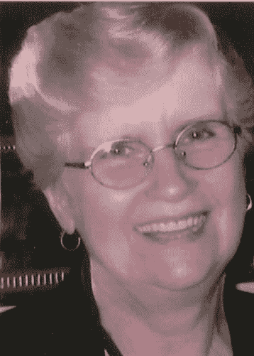

<!--yml

分类：未分类

日期：2024-05-18 19:09:05

-->

# VIX and More: For My Mother

> 来源：[`vixandmore.blogspot.com/2007/06/for-my-mother.html#0001-01-01`](http://vixandmore.blogspot.com/2007/06/for-my-mother.html#0001-01-01)

我的母亲，安·卢比，昨天因白血病长期斗争后去世。

多年来，我从她那里学到了许多东西，留下了许多珍贵的回忆，但她的离去给我的生活留下了巨大的空白。不用说，我爱她，会非常怀念她。

当她刚从大学毕业时，我母亲在康涅狄格州哈特福德市的一所城市高中找到了一份教数学的高中老师工作。她特别喜欢教那些数学最困难的学生，并乐于通过将难以理解的概念转化为游戏和实际生活应用，让他们觉得数学有趣。

我可能不超过八岁，她就送我一把尺规，帮我理解数字不仅仅是需要记忆的表格，而是概念和关系，这些能将世界的许多复杂性简化为简单的真理。当时我还不知道蒙特卡洛模拟是什么，但她教会我如何计算打击率和 ERA 后，我就拿了一把骰子和很多纸，创造了骰子棒球联赛，在这个过程中内化了概率和分布，所以对我来说创建模拟棒球联赛、球队、比赛和球员的统计数据变得轻而易举，这些统计数据在统计意义上与芬威公园和洋基体育场记录的统计数据一样真实。不用说，当我的其他同学几年后终于开始学习除法时，我只是微笑点头。

虽然她一生中一直是某种形式的老师，但我母亲总是比任何事情都更想成为一名记者。当她的事业朝着新闻方向发展时，我在旁边为她加油，学习关于信息收集、分析、构思和以说服性方式呈现的一切我能学到的东西。

直到最近一两天，我才意识到我不仅发现自己追求一些她生前热爱的学科，而且我在博客中表达的想法也是她一生工作的延续。

一代传一代的接力棒并不总是像一些人希望的那样顺利。在这种情况下，我准备得不能再好了。谢谢你，妈妈，谢谢你当一个好老师，谢谢你为我做的一切。

最后，无论她旅行得多近或多远，我母亲总是给我寄一张明信片。妈妈，这张是给你的。
