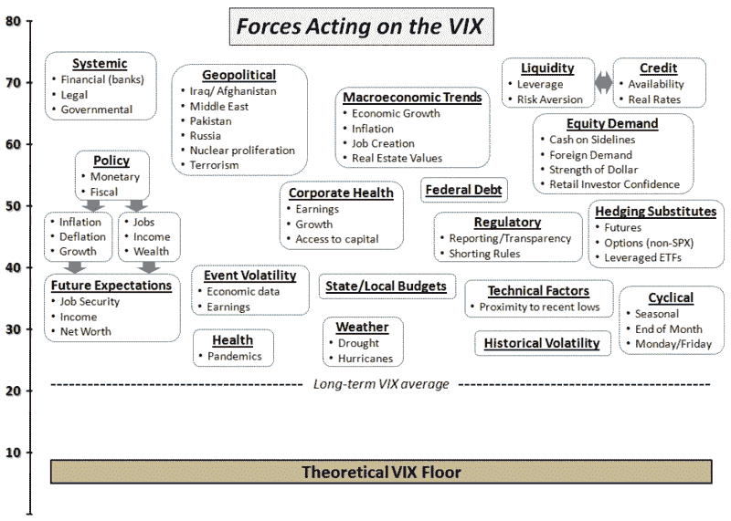

<!--yml

分类：未分类

日期：2024-05-18 17:37:00

-->

# VIX and More: 影响 VIX 的力量

> 来源：[`vixandmore.blogspot.com/2009/07/forces-acting-on-vix.html#0001-01-01`](http://vixandmore.blogspot.com/2009/07/forces-acting-on-vix.html#0001-01-01)

我收到了很多要求评论最近 VIX 下跌的请求，在我写下这些话时，VIX 停留在 23.23。还有[VIX:VXV 比率](http://vixandmore.blogspot.com/search/label/VIX%3AVXV)，我预计当前的牛市行情会走多远，等等。

我将在这个周末处理大部分事情（而且[新闻通讯订阅者](http://vixandmoresubscriber.blogspot.com/)无疑会对我思考的更多细节有一个清晰的认识），但我认为现在是放一张试图捕捉影响 VIX 的众多力量之一的图表的好时机。向前看，我相信当谈论 VIX 时有一个框架可以参考，这可能有助于使一些对话更加扎实。

当一切都说完时，VIX 反映了标普 500 指数期权的供需情况。然而，影响 VIX 日常或每周波动的因素总是在变化。下面的图表是我今天早上为了把一些这些因素放在一页上而进行的头脑风暴的结果。我开始了对影响 VIX 的力量进行分组，并使用一些箭头来指示各种因素之间的关系，等等，但显然这需要一点时间浸泡才能看起来像一个成品。因此，我想我可能会在这里发布这个图表，并征求读者的反馈。

*[请注意 VIX 轴上形状的相对位置不一定表示它们可能对 VIX 产生的潜在影响。起初，我希望图表能够以相对重要性尺度包含每个因素，同时还有分组和箭头，有助于描述因素之间的关系。我认为这可能是在二维空间里有点过于天真的想法，所以下面的图表有一些相对重要性和一些关系，但离最终的说法还远着呢。]*

