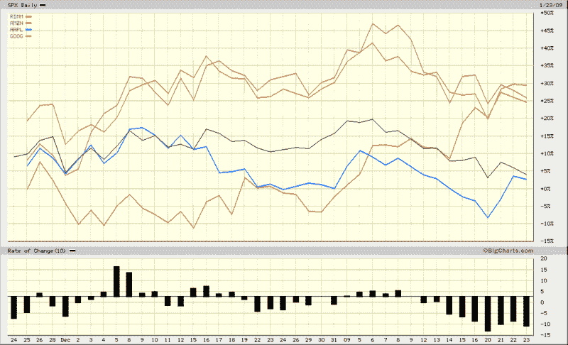

-   <!--yml

-   category: 未分类

-   date: 2024-05-18 18:03:57

-   -->

# -   VIX and More: Four Horsemen of Technology Running Strong Again?

> -   来源：[`vixandmore.blogspot.com/2009/01/four-horsemen-of-technology-running.html#0001-01-01`](http://vixandmore.blogspot.com/2009/01/four-horsemen-of-technology-running.html#0001-01-01)

-   在这个市场中，我觉得很难将任何股票视为“表现强劲”，除非它们属于贵金属行业，但强劲也可以是一个相对的词汇。

-   有些股票在过去几周和几个月的表现要好于其他股票，甚至显示出相当大的买入兴趣。过去突出显示的四只股票被称为[科技四骑士](http://vixandmore.blogspot.com/2007/10/four-generals-will-tell-story.html)：黑莓公司（[RIMM](http://finance.google.com/finance?q=rimm)）；亚马逊（[AMZN](http://finance.google.com/finance?q=amzn)）；谷歌（[GOOG](http://finance.google.com/finance?q=goog)）；以及苹果公司（[AAPL](http://finance.google.com/finance?q=aapl)）。

-   这四只大型科技股的股价最近都提供了正面的盈利惊喜，最新的惊喜出现在昨日下午的谷歌身上。如果不是因为史蒂夫·乔布斯的健康问题，这四只股票在过去两个月内所标明的图表中，早就超越了标普 500 指数。事实上，即使考虑到乔布斯的问题，苹果公司的股价与大盘指数相比也相对平稳。

-   投资者们正在猜测哪些股票将在下一轮牛市中提供[领导力](http://vixandmore.blogspot.com/search/label/leadership)。我猜测下一组领导者将包括这些科技巨头中的一家或多家。

-   *[来源：BigCharts]*

-   *提示：撰写本文时，持有 GOOG 股票。*
