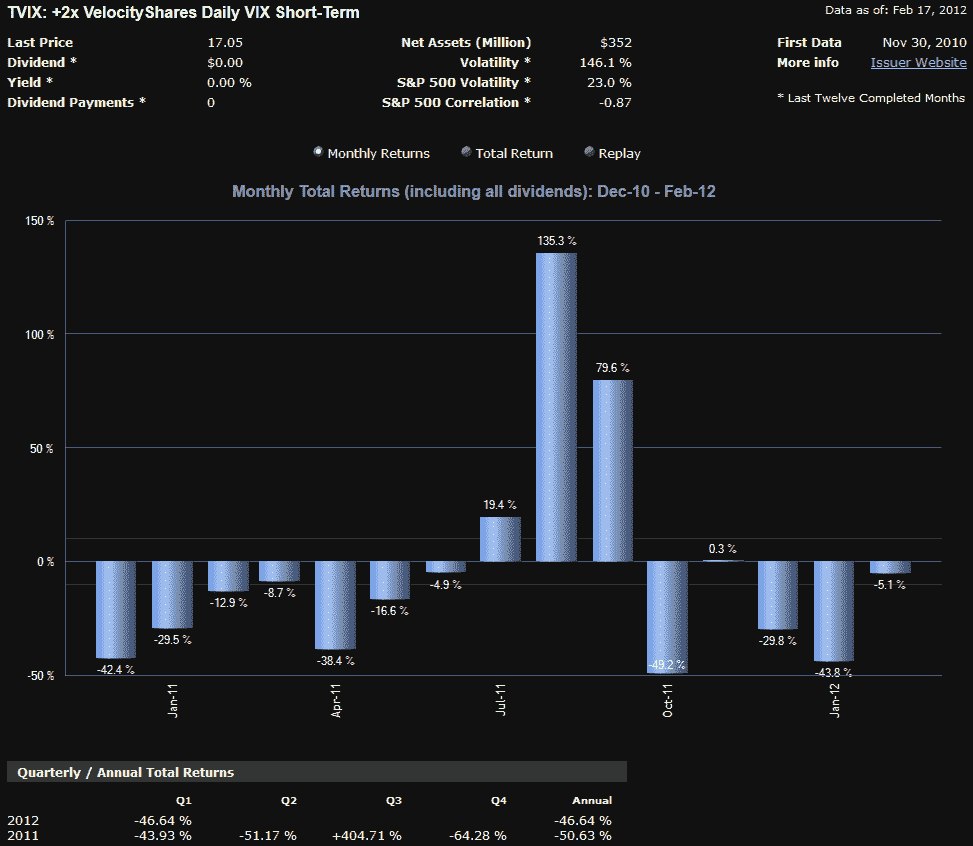

<!--yml

类别：未分类

日期：2024-05-18 16:39:22

-->

# VIX and More: 四种影响 TVIX 价格的关键因素

> 来源：[`vixandmore.blogspot.com/2012/02/four-key-drivers-of-price-of-tvix.html#0001-01-01`](http://vixandmore.blogspot.com/2012/02/four-key-drivers-of-price-of-tvix.html#0001-01-01)

[TVIX](http://vixandmore.blogspot.com/search/label/TVIX)（VelocityShares 每日 2 倍 VIX 短期 ETN）是 VIX 交易所交易产品（ETP）领域的新的摇滚明星。

它并非一炮而红，我在它推出两周后（2010 年底）就预测过，“TVIX 将达到临界点，成为日交易者的宠儿。”实际上，我很惊讶 TVIX 吸引这么多关注需要这么长时间。

然而，随着所有的新关注，也带来了很多不完全理解推动 TVIX 价格的哪些因素的新投资者。在过去的一周左右，我涉及了一些这些问题，但以下是每位投资者都应该了解的 TVIX 价格的四种关键驱动因素：

1.  **波动性** – 这似乎很显然，但在短期内，当月和次月 VIX 期货的波动几乎解释了 TVIX 价格的所有变化。对于日交易者来说，TVIX 基本上是交易 VIX 期货的替代品，除了杠杆之外，以下其他因素都无关紧要。

1.  **杠杆** – 另一个显而易见因素，TVIX 的 2 倍杠杆意味着，平均而言，它在百分比上的涨跌速度与 VIX 相当，是当月和次月 VIX 期货组合的两倍。短期内，杠杆主要意味着基础资产的波动被放大；长期内，杠杆会增强波动性的复合增长，并对价格产生负面影响。

1.  **正向市场** – 由于 VIX ETP 成为波动性作为资产类别的基石，与 VIX 期货的期限结构有关的问题，尤其是正向市场和负向滚动收益率，已经成为这一领域最常讨论的问题。简单地说，当月和次月 VIX 期货大部分时间都处于正向市场，这意味着对 TVIX 价格的月度拖累超过了 30 年期美国国债的当前年度收益率。

1.  **波动率复合** - 杠杆化证券表现出越多波动性，波动性对长期表现产生负面影响的程度就越大。这个问题就像有人拥有一家服装店，先把裙子降价 50%，然后又上涨 50%，或者颠倒时间和顺序，先上涨 50%，然后下降 50%。无论如何，这条裙子的价值都会下降 25%。这对杠杆化 ETP 也是如此，价格衰减的程度直接取决于波动性。

如果你结合所有四个因素，你将得到一个非常适合日交易的产品，因为它可以在压缩的时间框架内避开 contango 和波动率复合问题。然而，对于买入并持有的投资者来说，contango 加上波动率复合是一个导致巨大损失的配方。

下面的图表用视觉方式展示了这种赌博。在大多数情况下，那些长期持有 TVIX 的人将面临重大且持续的损失，但总是存在一种可能性，即在所有四个力量与多头一致并且 TVIX 急剧上涨的情况下，抓住短暂的行情，正如 2011 年 8 月和 9 月的情况一样。不幸的是，这种情况很少见。

底线是，如果你已经投资了 TVIX，或者正在考虑投资 TVIX，并且没有完全理解上述四个问题及其对 TVIX 短期和长期投资的影响，那么你可能需要停止交易并增加你的知识储备（因此以下有链接），以免学到昂贵的教训。

相关文章：

****

**来源：[ETFreplay.com]**

**披露：** *在撰写本文时 short TVIX*
