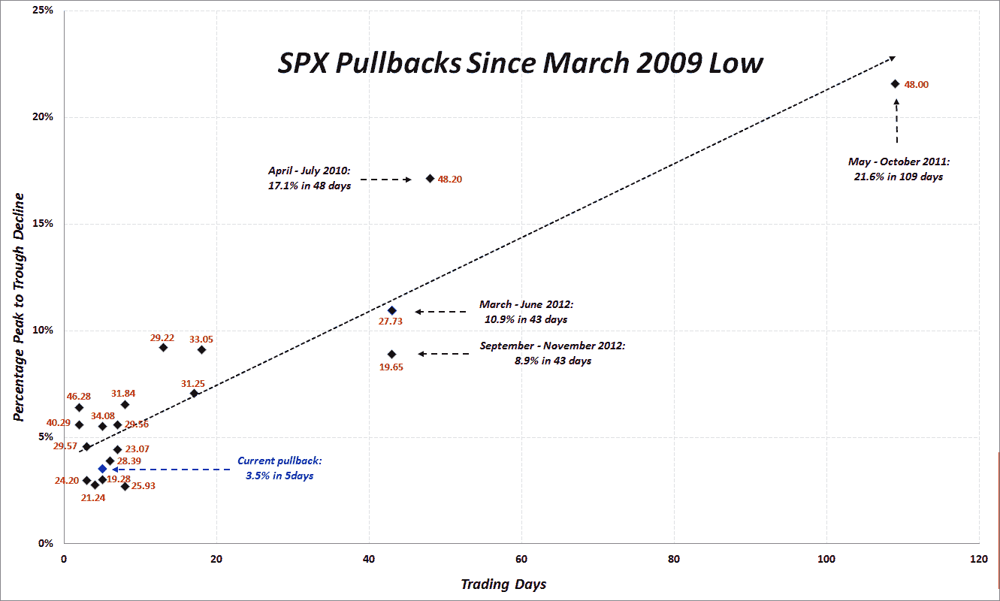

<!--yml

分类：未分类

日期：2024-05-18 16:16:59

-->

# 维基和更多：一幅图中四年的 SPX 回调

> 来源：[`vixandmore.blogspot.com/2013/04/four-years-of-spx-pullbacks-in-one-plot.html#0001-01-01`](http://vixandmore.blogspot.com/2013/04/four-years-of-spx-pullbacks-in-one-plot.html#0001-01-01)

每次股票调整时，我都会不断地收到读者要求更新我的 SPX 回调摘要数据的请求，正如我在 2 月 26 日（星期二）在[更新后的 SPX 回调摘要表](http://vixandmore.blogspot.com/2013/02/updated-spx-pullback-summary-table-for.html)中所做的那样，当时标普 500 指数从近期高点回调了 3.0%。

与其简单地在该表中增加一行以捕捉从周四的 SPX 1597 高点到今天早盘的 1541 低点的 3.5%的峰值到谷底跌幅，不如更新一张自 2009 年 3 月股市底部以来我所编目过的所有 20 次回调的旧图表更有启发性。

在下面的图表中，y 轴捕捉峰值到谷底的跌幅（反转）的幅度，x 轴记录该行动的持续时间。在冒险使图形成为某种眼图的情况下，我还包括了每次回调期间的 VIX 峰值，每个点都有一个红色的标签。为了好玩，长期虚线黑色线条是对所有数据点的线性拟合。

我对一些较大的回调数据进行了注释，并用蓝色文本突出了当前的回调。一些人可能会发现有趣的是，值得注意的是，在当前回调期间，除了 VIX 峰值为 17.90 的外，每一次回调 VIX 都超过了 19.00。

当然，不能保证当前的回调会在 3.5%处停止，但如果它确实如此，这将是 2009-2013 年牛市中最温和的回调之一。

数据来源：CBOE，Yahoo，VIX 和更多 -->

相关文章：

***披露：*** *无*
