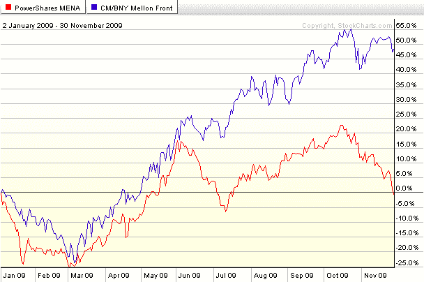

<!--yml

类别：未分类

日期：2024-05-18 17:21:39

-->

# VIX 和更多：前沿 ETF

> 来源：[`vixandmore.blogspot.com/2009/11/frontier-country-etfs.html#0001-01-01`](http://vixandmore.blogspot.com/2009/11/frontier-country-etfs.html#0001-01-01)

在昨天的[本周图表](http://vixandmore.blogspot.com/search/label/chart%20of%20the%20week)中，我研究了三个对[中东](http://vixandmore.blogspot.com/search/label/Middle%20East)有暴露的 ETF：

+   市场 vectors 阿拉伯湾国家 ETF ([MES](http://vixandmore.blogspot.com/search/label/MES))

+   Wisdom Tree 中东股息 ETF ([GULF](http://vixandmore.blogspot.com/search/label/GULF))

+   SPDR 标普新兴中东和非洲 ETF ([GAF](http://vixandmore.blogspot.com/search/label/GAF))

鲜为人知的是，中东 ETF 实际上是相对较新的一类 ETF——前沿 ETF 的一个子集。[前沿 ETF](http://vixandmore.blogspot.com/search/label/frontier%20ETFs)中许多是单一国家 ETF，但有两个特别突出，作为多元化的前沿投资：

+   PowerShares MENA 前沿国家组合 ETF ([PMNA](http://vixandmore.blogspot.com/search/label/PMNA))

+   Claymore/BNY 梅隆前沿市场 ETF ([FRN](http://vixandmore.blogspot.com/search/label/FRN))

我把 PMNA([持仓](http://www.invescopowershares.com/products/overview.aspx?ticker=pmna))放在第一位，因为它不是一个全球性的 ETF，而是一个区域性的 ETF，基于纳斯达克 OMX 中东北非指数。目前，该基金对波斯湾的重视程度很高，可以被视为比 MES 和 GAF 略微更流动（但仍然相对不流动）的替代品，每日交易约 10,000 股。截至上周，最大的国家分配是在阿联酋（22.6%）、埃及（20.2%）和科威特（16.9%）。

与 PMNA 相比，FRN([持仓](http://www.claymore.com/etf/fund/frn))采取了更加广泛和地理多元化的全球方法，没有特定的区域重点。具体来说，该 ETF 旨在跟踪纽约梅隆银行新前沿 DR 指数。截至 2024 年 9 月 30 日，最大的国家分配是在智利（28.6%）、波兰（15.9%）和埃及（15.4%）。

下面的图表显示，尽管 PMNA 和 FRN 在 2009 年的前五个月内绩效表现非常相似，但更加多元化的 FRN 在后半年的表现更为强劲。毫不奇怪，鉴于 PMNA 对波斯湾的暴露，在最近几天，两者之间的差距已经显著拉大。

除了这些多国前沿 ETF 和区域前沿 ETF（如 Market Vectors 非洲 ETF ([AFK](http://vixandmore.blogspot.com/search/label/AFK)))，还需要记住有许多单一国家 ETF 可供选择，地理多样性日益增加。就在上周，首个波兰 ETF ([PLND](http://vixandmore.blogspot.com/search/label/PLND)) 上市。对于那些对单一国家中东 ETF 感兴趣的投资者，Van Eck 计划推出新的埃及和科威特 ETF。

最后，需要考虑的是，前沿 ETF 可能只会吸引那些能够承受高风险的投资者。多国和单一国家变体 ETF 面临低流动性和高波动性，因此，在交易量从当前水平显著增加之前，建立大量头寸是不明智的。

**[来源：StockCharts.com]**

****披露：无****
