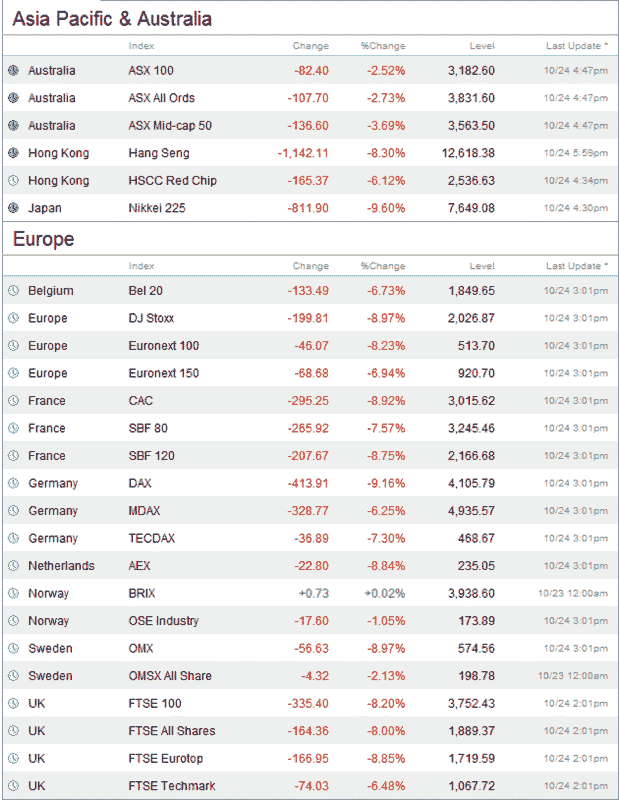

<!--yml

分类：未分类

日期：2024-05-18 18:19:06

-->

# VIX 和更多：期货跌停；今天将会非常糟糕。

> 来源：[`vixandmore.blogspot.com/2008/10/futures-limit-down-today-will-be-very.html#0001-01-01`](http://vixandmore.blogspot.com/2008/10/futures-limit-down-today-will-be-very.html#0001-01-01)

可能会引发新一轮的“不良反应循环”。

看到 VIX 超过 100 不要感到惊讶。

在美国开盘前，全球市场处于恐慌模式：

[来源：CNN]
