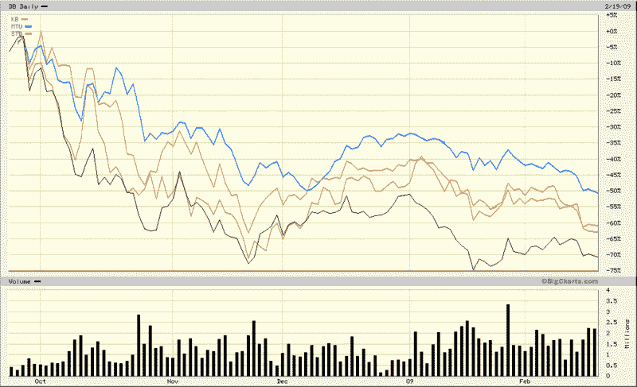

<!--yml

类别：未分类

日期：2024-05-18 17:58:52

-->

# VIX 和更多：后雷曼兄弟时代的全球银行股票

> 来源：[`vixandmore.blogspot.com/2009/02/global-bank-stocks-in-post-lehman-world.html#0001-01-01`](http://vixandmore.blogspot.com/2009/02/global-bank-stocks-in-post-lehman-world.html#0001-01-01)

我对谈论银行感到厌倦，但这将是未来可见时间的*故事*。尽管花旗集团([C](http://vixandmore.blogspot.com/search/label/C))的普通股票濒临 2.00 的水平（我们可以称它为[门多萨](http://en.wikipedia.org/wiki/Mendoza_Line)银行吗？）并坚称它没有与政府就国有化进行过对话，但股价勉强超过 3.00 水平的美国银行([BAC](http://vixandmore.blogspot.com/search/label/BAC))也表示：“我们看到没有理由将一家盈利良好、资本充足并积极放贷的银行国有化。”在金融炖菜中加入股价首次跌破 10.00 的富国银行([WFC](http://vixandmore.blogspot.com/search/label/WFC))，让人难以不沉迷于银行部门。

尽管讨论了很多美国银行的问题，但我希望转向全球市场。最近，英国银行和爱尔兰银行成为了可能国有化的传闻目标，所以我将跳过这些国家的银行，而是专注于两个关键欧洲国家（德国和西班牙）和两个关键亚洲国家（日本和韩国）的最大银行。这四家银行分别是德意志银行([DB](http://vixandmore.blogspot.com/search/label/DB)), 桑坦德银行([STD](http://vixandmore.blogspot.com/search/label/STD)), 三菱日联金融([MTU](http://vixandmore.blogspot.com/search/label/MTU))和韩国国民银行([KB](http://vixandmore.blogspot.com/search/label/KB))。这四家银行碰巧都在美国通过[美国存托凭证](http://en.wikipedia.org/wiki/American_Depositary_Receipt) (ADRs)进行交易。

在下面的图表中，我绘制了自去年 9 月底以来所有四家大银行的表现，当时雷曼兄弟破产和 AIG 国有化的连锁反应开始在全球范围内感受到。毫不奇怪，四家银行的股价都下跌了超过 50%，其中德意志银行是表现最差的银行，而三菱日联金融受到的痛苦最小。作为比较，大多数爱尔兰和英国银行在同一时期下跌了超过 90%。

全球银行危机显然还有很长的路要走，任何人都可以自信地说它已经过去。在此期间，即使是美国投资者没有密切关注的一个中等国家的银行，也可能导致另一个临界点，使全球金融系统更接近边缘。那些想要密切关注全球金融机构的投资者可能还想密切关注 iShares 全球金融机构 ETF ([IXG](http://vixandmore.blogspot.com/search/label/IXG))。

*[来源：BigCharts]*
