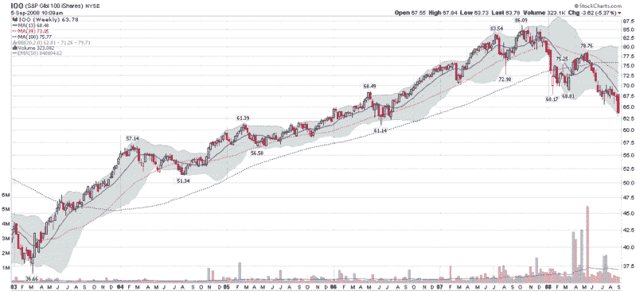

<!--yml

类别：未分类

日期：2024-05-18 18:28:04

-->

# VIX 和更多：全球股市跌破支撑位

> 来源：[`vixandmore.blogspot.com/2008/09/global-equities-falling-through-support.html#0001-01-01`](http://vixandmore.blogspot.com/2008/09/global-equities-falling-through-support.html#0001-01-01)

美国市场现在可能看起来很糟糕，但全球市场的状况更糟。如果你真的想看到一个糟糕的市场，那就拉一下韩国[KOSPI](http://stockcharts.com/charts/gallery.html?%24KOSPI)的图表吧。

对于一个具有全球视角的 ETF，我是[iShares S&P Global 100 Index](http://www2.standardandpoors.com/portal/site/sp/en/us/page.topic/indices_gbl100/2,3,2,1,0,0,0,0,0,2,1,0,0,0,0,0.html) ETF([IOO](http://finance.google.com/finance?q=ioo))的粉丝，该 ETF 由 100 家市值（平均 100 亿美元）的大型跨国公司组成，这些公司是根据公司外国资产、收入和员工的比重来选出的。想了解更多详情，请查看[S&P 100 的持仓](http://www2.standardandpoors.com/portal/site/sp/en/us/page.topic/indices_gbl100/2,3,2,1,0,0,0,0,0,2,3,0,0,0,0,0.html)。

正如 IOO 的周线图所示，本周全球股市的恶化速度显著加快，股价跌破了技术支撑位，将 IOO 带回到了 2006 年 7 月以来的水平。如果 IOO 不能守住 2006 年的支撑位 61.00，那么出现另一个更糟糕的下跌行情当然是一个明显的可能性。

 [来源：StockCharts]
