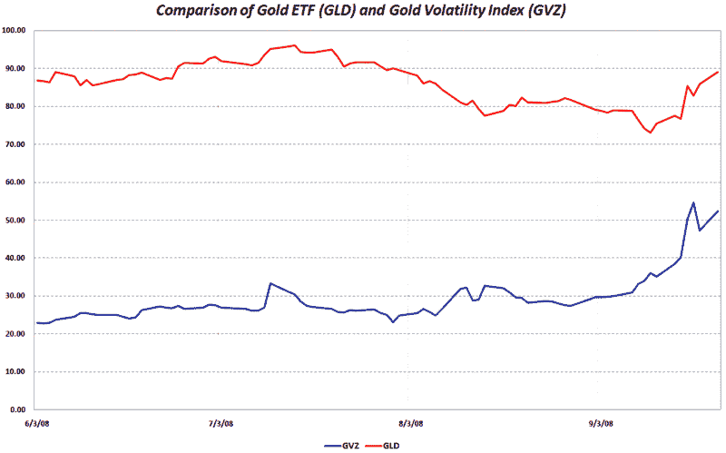

<!--yml

分类：未分类

日期：2024-05-18 18:25:21

-->

# VIX 和更多：黄金与黄金波动性

> 来源：[`vixandmore.blogspot.com/2008/09/gold-and-gold-volatility.html#0001-01-01`](http://vixandmore.blogspot.com/2008/09/gold-and-gold-volatility.html#0001-01-01)

随着金融危机新篇章的展开，[黄金](http://vixandmore.blogspot.com/search/label/gold)作为避险投资受到了广泛关注。在上周二 Reserve Primary Fund 的“[美元贬值](http://www.cnn.com/2008/BUSINESS/09/17/money.fund.ap/index.html)”之后，投资者对货币市场基金的信心开始动摇，黄金的涌入因此加剧。

一周之后，金融市场仍然充满了[恐慌](http://vixandmore.blogspot.com/search/label/fear)和焦虑，黄金价格几乎两个月来首次达到最高水平。

在下面的图表中，我绘制了[GLD](http://vixandmore.blogspot.com/search/label/GLD)，最受欢迎的黄金 ETF，以及[GVZ](http://vixandmore.blogspot.com/search/label/GVZ)，基于 GLD 的 CBOE 黄金波动率指数（或黄金 VIX）的走势，该指数于[去年 8 月 1 日](http://vixandmore.blogspot.com/2008/08/evolution-of-volatility-index-family.html)推出。

与[OVX](http://vixandmore.blogspot.com/search/label/OVX)（CBOE 石油波动率指数）的情况一样，黄金价格和黄金波动率指数之间通常存在正相关关系。请注意，在 8 月初，GLD 和 GVZ 之间的相关性从正变为负，尽管黄金价格下跌，但黄金波动率开始上升。然而，在大约 9 月 11 日，GLD 和 GVZ 之间的相关性再次回到强烈的正相关，这种关系在过去两周内保持不变。这种相关性的转变恰好发生在极度金融恐慌的一周之前，这可能只是一个巧合，但我想至少种下这个种子，并注意我将关注这些及其他相关主题，当我评估这些领域中的[新波动率指数](http://vixandmore.blogspot.com/2008/08/evolution-of-volatility-index-family.html)时。

来源：[VIX 和更多](http://vixandmore.blogspot.com/)
