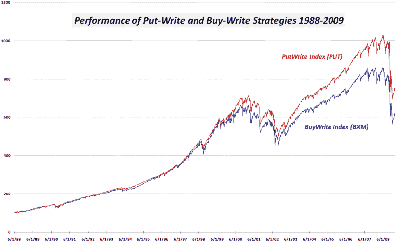
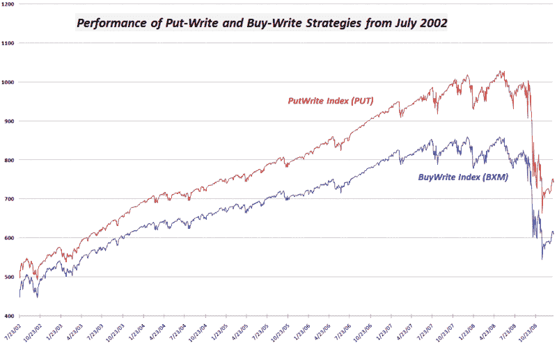

<!--yml

类别：未分类

日期：2024-05-18 18:06:38

-->

# VIX 和更多：看跌期权写入和买入期权写入指数表现比较图表

> 来源：[`vixandmore.blogspot.com/2009/01/graphical-comparison-of-performance-of.html#0001-01-01`](http://vixandmore.blogspot.com/2009/01/graphical-comparison-of-performance-of.html#0001-01-01)

我很高兴看到周五的[经常被忽视的看跌期权写入策略](http://vixandmore.blogspot.com/2009/01/often-overlooked-put-writing-strategy.html)产生了强烈的反响，特别是在 Seeking Alpha 上的评论，该文章在那里[被重新发布](http://seekingalpha.com/article/114076-put-writing-too-often-overlooked)。有几个问题提出了关于为什么两个在合成上等价（即具有相同的盈亏图表）的策略会有不同的表现特征的原因。我把表现差异的主要原因归结为由于倾向于对看跌期权定价高于看涨期权，特别是在市场压力极大的时候，此时对看跌期权的需求往往超过对看涨期权的需求。

我不确定我能否在这个领域证明波动率偏斜假设，但我确实整理了两张表现图表，这些图表可能有助于进一步讨论。使用 CBOE 看跌期权写入指数([PUT](http://vixandmore.blogspot.com/search/label/PUT))和 CBOE 买入期权写入指数([BXM](http://vixandmore.blogspot.com/search/label/BXM))作为我的数据源，我从它们的 1988 年创立(上面)和 2002 年(下面)开始绘制这两个指数，当时这两个指数开始出现显著分歧。

从这两张图表中，我发现有趣的是，在 2002-07 年的牛市中，**看跌期权写入**策略开始与**买入期权写入**策略产生分离。随着 2007 年波动性的增加，看跌期权写入策略继续拉大差距，最近的熊市对这两种策略的表现差异影响非常小。

对于那些对不同市场周期中表现差异背后的原因有任何想法的人，请随时发表意见。

来源：[CBOE, VIX 和更多](http://vixandmore.blogspot.com/search/label/source:CBOE,VIXandMore)
