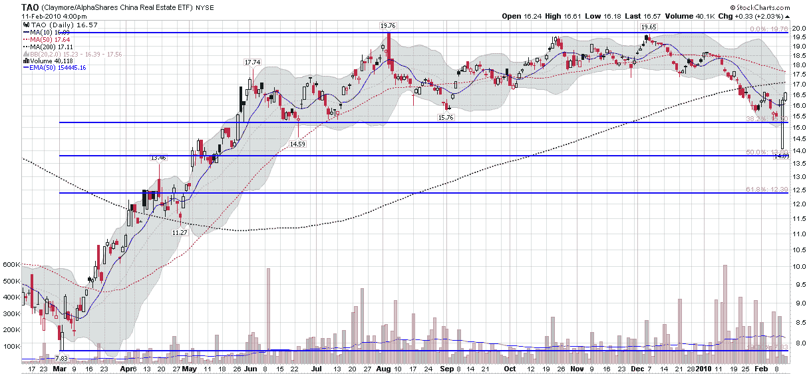

<!--yml

分类：未分类

日期：2024-05-18 17:15:36

-->

# VIX 和更多：希腊还是中国房地产？

> 来源：[`vixandmore.blogspot.com/2010/02/greece-or-chinese-real-estate.html#0001-01-01`](http://vixandmore.blogspot.com/2010/02/greece-or-chinese-real-estate.html#0001-01-01)

几天前我提出了一个问题，[你在关注希腊吗？](http://vixandmore.blogspot.com/2010/02/are-you-watching-greece.html)虽然我相信大多数投资者都在尽力掌握关于[希腊](http://vixandmore.blogspot.com/search/label/Greece)和欧盟的最新消息，但我提出的小问题是哪个证券或指标能让我们较好地了解希腊问题的现状。

虽然目前对希腊的关注是理所当然的，但很容易争论中国银行[存款准备金率的提高](http://www.nytimes.com/2010/02/13/business/global/13yuan.html)对全球经济增长同样构成了巨大威胁。

不幸的是，在中国获得良好的经济数据很难([中国](http://vixandmore.blogspot.com/search/label/China))，但随着关于[潜在房地产泡沫](http://news.xinhuanet.com/english2010/indepth/2010-02/11/c_13171603.htm)的讨论，投资者应该将大量注意力集中在中国的[房地产](http://vixandmore.blogspot.com/search/label/real%20estate)上。好消息是，有一只中国房地产 ETF，它有着相对较长的历史记录，流动性良好，可以作为衡量中国房地产行业的一个优秀指标。该 ETF 代码为[TAO](http://vixandmore.blogspot.com/search/label/TAO)，即 Claymore/AlphaShares 中国房地产 ETF([持仓](http://www.claymore.com/etf/fund/tao/holdings))，包括中国大陆、香港和澳门的 REITs 和上市公司。

下面的图表捕捉了 TAO 一年的价格行动。请注意，在下面的图表中，周三的长白色蜡烛几乎肯定是由于错误的数据。排除开盘时的那个坏数据，周五的低点 15.31 至少是一个短期周期低点。

至少，投资者应该关注 TAO。除此之外，TAO 是外国人猜测中国房地产趋势和/或对冲其投资组合的好方法。

关于相关主题的更多信息，读者们可以查阅以下内容：

来源：[StockCharts]

***披露：*** *写作时持有 TAO*
