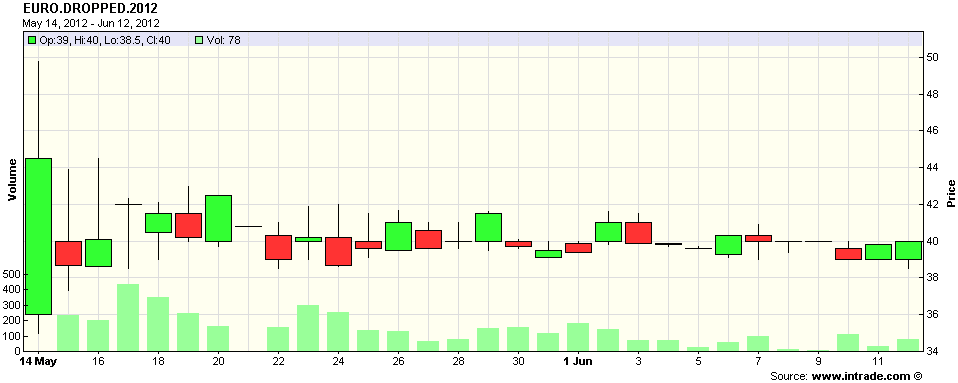

<!--yml

category: 未分类

date: 2024-05-18 16:28:08

-->

# VIX and More: Greek Elections and the Future of the Euro

> 来源：[`vixandmore.blogspot.com/2012/06/greek-elections-and-future-of-euro.html#0001-01-01`](http://vixandmore.blogspot.com/2012/06/greek-elections-and-future-of-euro.html#0001-01-01)

-   尽管本周的新闻焦点一直是[西班牙](http://vixandmore.blogspot.com/search/label/Spain)，西班牙，[意大利](http://vixandmore.blogspot.com/search/label/Italy)和西班牙（让人想起一个[老的蒙特·佩莱林喜剧](http://www.youtube.com/watch?v=g8huXkSaL7o)片段，但我扯远了），但很容易暂时忘记[希腊](http://vixandmore.blogspot.com/search/label/Greece)将在周日举行新一轮选举。

由于希腊法律禁止在选举前 14 天进行民意调查或发布民意调查结果，我们不知道关于救助和留在[欧元](http://vixandmore.blogspot.com/search/label/euro)区的选民情绪可能是上升还是下降。希腊选民当然有很多事情要考虑，其中一些可能被[齐普拉斯](http://vixandmore.blogspot.com/search/label/Syriza)领导人的立场搞复杂了，他坚持认为可以废除救助协议，用一个新的基于刺激经济增长和就业创造的计划重新开始——而在这个过程中永远不需要离开欧元区。

那么希腊选举将如何影响欧元的未来？

没有民意调查，[Intrade](http://vixandmore.blogspot.com/search/label/Intrade)的合约，规定“任何目前使用欧元的国家在 2012 年 12 月 31 日午夜前宣布放弃它的意图”，现在变得更加有价值的信息资源。问题是，尽管有一定的活动量，这个合约的价格在过去一个月里基本上没有变化，保持在 40 的水平（见下方的图表），这意味着参与者继续认为希腊在本年底退出（我拒绝说“Grexit”）的可能性大约是 40%。

-   到周一我们将会有更多的信息，但再次强调，组成联合政府的过程可能会证明是麻烦的…或者更糟。

对于那些寻找下周金融市场恐慌的对冲工具的人来说，请注意，[VIX 期权](http://vixandmore.blogspot.com/search/label/VIX%20options) 本周不会到期，而是在 6 月 20 日（星期三）到期。因此，VIX 看涨期权可能至少是短期选举后焦虑的对冲工具。对于那些寻求每周而不是每月 basis 的波动对冲的人来说，研究 VXX 周期权可能会有所帮助([A Favorite Trade: VXX Weeklys](http://vixandmore.blogspot.com/2012/06/favorite-trade-vxx-weeklys.html))。最后但并非最不重要的是，读者喜欢的一篇关于构建对冲过程的思考文章是 [Cheating with Partial Hedges](http://vixandmore.blogspot.com/2012/05/cheating-with-partial-hedges.html)。

相关文章：

来源：[Intrade.com]

***披露(s):*** *在撰写本文时做空 VXX*
