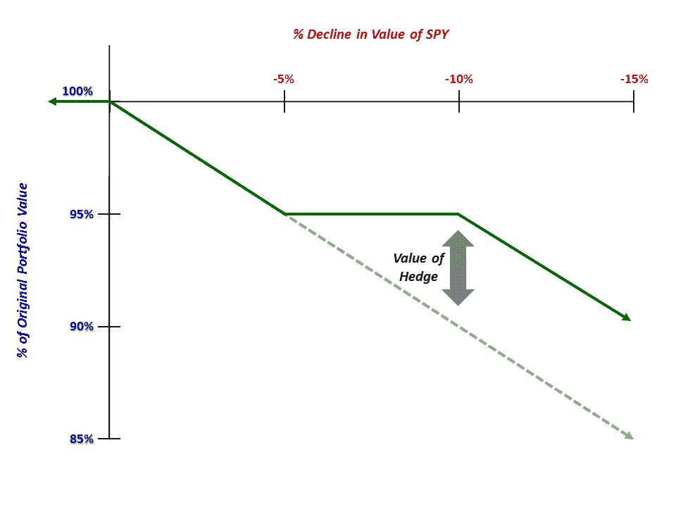

<!--yml

类别：未分类

日期：2024-05-18 16:16:49

-->

# VIX 和更多内容：为《巴伦周刊》的“Striking Price”栏目撰写客座文章：如何为你的股票组合投保

> 来源：[`vixandmore.blogspot.com/2013/04/guest-columnist-at-striking-price-for.html#0001-01-01`](http://vixandmore.blogspot.com/2013/04/guest-columnist-at-striking-price-for.html#0001-01-01)

今天我在《巴伦周刊》的“Striking Price”栏目中代表 Steven Sears 撰写的客座文章，这是我有机会为巴伦撰写专栏的第十次，这次我甚至设法抑制了直接写 VIX 和波动性的冲动。

在《如何为你的股票组合投保》一文中，我深入探讨了我在一篇[名人堂](http://vixandmore.blogspot.com/search/label/hall%20of%20fame)文章中提到的一个[对冲](http://vixandmore.blogspot.com/search/label/hedging)要素，具体是关于[部分对冲](http://vixandmore.blogspot.com/2012/05/cheating-with-partial-hedges.html)的。具体来说，我讨论了[熊市看跌期权价差](http://vixandmore.blogspot.com/search/label/bear%20put%20spread)，我喜欢将其视为“缺口对冲”，因为它们在两个执行价格之间提供保护。

《巴伦周刊》的文章讨论了一种涉及购买 5%虚值的看跌期权，并通过出售 10%虚值的看跌期权来对冲部分保护成本的 SPY 缺口对冲策略（这种策略也限制了下行保护的效果）。按照 1:1 的比例进行操作，这是一个典型的熊市看跌期权价差，对 SPY 头寸会产生以下影响：

*[图示显示 5% - 10%熊市看跌期权价差或“缺口对冲”提供的保护范围]*

在《巴伦周刊》文章中我没有足够的空间讨论的可能是将 1x1 头寸转换为[比率看跌价差](http://vixandmore.blogspot.com/search/label/ratio%20put%20spread)，通过出售*两个*10%虚值看跌期权来购买每一个购买的 5%虚值看跌期权。随着 SPY 今天收盘价为 154.14，离 5%回调最近的执行价是 146，7 月看跌期权目前为 2.55 美元。与此同时，10%虚值执行价为 139，而 7 月的 139 看跌期权为 1.40 美元。根据这些数字，可以以 0.25 美元的信用开启 1x2 比率价差，提供 SPY 139（今日收盘价的 9.8%下方）的保护，基本上是免费的。这里的重要警告是，没有免费的投资组合保护这种事情。这里发生的是，从 1x1 看跌价差转向 1x2 比率价差，头寸从有限风险头寸转变为无限风险头寸，投资者面临的风险是 SPY 在 7 月 20 日到期之前跌破 139。因此，看跌比率价差-或者任何具有无限风险的期权交易-应仅由高级期权交易者使用。相比之下，标准的 1x1 看跌价差是初学者和中级期权交易者寻求掌握的极好交易。

相关帖子：

我在《巴伦周刊》的全部投稿列表：

+   [如何保险您的股票投资组合](http://online.barrons.com/article/SB50001424052748703318404578430882101527030.html?mod=BOL_hps_highlight_mid)（2013 年 4 月 18 日）

+   [期权交易的理由](http://online.barrons.com/article/SB50001424052748703792204578217484255589840.html?mod=BOL_hps_highlight_bottom)（2013 年 1 月 2 日）

+   [冷静并利用他人的焦虑](http://online.barrons.com/article/SB50001424052748704526104578118984076144580.html)（2012 年 11 月 14 日）

+   [如何在波动事件周围交易期权](http://online.barrons.com/article/SB50001424053111904184504577518802209654274.html)（2012 年 7 月 10 日）

+   [趁其他人恐惧时贪婪](http://online.barrons.com/article/SB50001424053111903935304577382010847832798.html?mod=BOL_hps_highlight_bottom)（2012 年 5 月 3 日）

+   [将波动性转化为资产类别的方法](http://online.barrons.com/article/SB50001424052970204201404576077942647562616.html?mod=BOL_hps_dc)（2011 年 1 月 12 日）

+   [在不确定性中寻找机会](http://online.barrons.com/article/SB50001424052970204743004575622694164710232.html)（2010 年 11 月 18 日）

+   [市场波动性是否会恢复到危机水平？](http://online.barrons.com/article/SB50001424052970204297404575493863568455090.html)（2010 年 9 月 15 日）

+   [预测波动性的危险](http://online.barrons.com/article/SB127430948974994023.html)（2010 年 5 月 20 日）

+   [在波动性上采取更长远的视角](http://online.barrons.com/article/SB124648899704482887.html)（2009 年 7 月 2 日）

***披露：*** *无*
