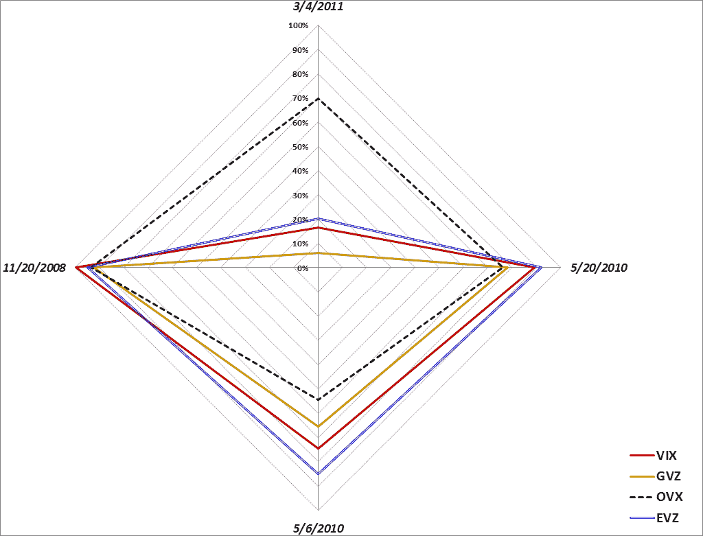

<!--yml

分类：未分类

日期：2024-05-18 16:14:28

-->

# [VIX and More: The Striking Price 专栏的客座作家：如何早期发现风险](http://online.barrons.com/article/SB50001424052748704093404578609670858329206.html)

> 来源：[`vixandmore.blogspot.com/2013/07/guest-columnist-at-striking-price-for.html#0001-01-01`](http://vixandmore.blogspot.com/2013/07/guest-columnist-at-striking-price-for.html#0001-01-01)

今天的客座专栏，[如何早期发现风险](http://online.barrons.com/article/SB50001424052748704093404578609670858329206.html)，代表史蒂文·西尔斯（Steven Sears）在[Barron’s](http://online.barrons.com/) 上的 *The Striking Price* 是我有机会为 Barron's 撰写专栏的第十一次。今天的专栏延续了我在 2011 年 3 月的 *Expiring Monthly* 文章中提到的一个主题，那篇文章的标题是《评估跨资产类别的波动性》。在那篇 2011 年的文章中，我介绍了一个波动性罗盘的概念，作为评估在[2008 年](http://vixandmore.blogspot.com/search/label/2008)的金融危机，截至 2010 年 5 月的[欧元区危机](http://vixandmore.blogspot.com/search/label/European%20sovereign%20debt%20crisis)，2011 年 3 月的[阿拉伯之春](http://vixandmore.blogspot.com/search/label/Arab%20Spring)以及 2010 年 5 月 6 日的[闪崩](http://vixandmore.blogspot.com/search/label/flash%20crash)中出现的不同类型波动性飙升的框架。**

*[波动性罗盘显示了最近四次波动性飙升期间各资产类别的不同波动性水平。来源：VIX and More]*

在 2011 年的文章中，我提供了以下思路概述：

> *“我相信，更好地理解跨资产类别的波动性情况将有助于更好地掌握波动性事件，并有助于识别出许多有利的交易设置。”*

后来，我用以下思想总结了文章：

> *“对于那些研究部门轮换策略和交易以地理为基础的交易所交易基金方法的人来说，其中一些分析技术可用于分析跨资产类别的波动性。”*
> 
> **最终，波动性研究既有科学成分，也有艺术成分，但跨资产类别的方法提供了对波动性景观的更广泛的整体视角，并在混合中增加了更多科学成分。**
> 
> *在某个时刻，波动性主要成为了对传染和连锁反应的研究。我毫不犹豫地说，多学科方法对于理解传染和连锁反应至关重要，并且跨资产类别的分析框架辅以诸如波动性罗盘之类的工具是探讨这一主题的有效途径。”**

在今天的《巴伦周刊》文章中，我扩展了关于四种波动性指数的想法，并讨论了提供地理不确定性以及[风险](http://vixandmore.blogspot.com/search/label/risk)快照的波动性指数，以及如美国国债和货币等资产类别的更广泛不确定性 and risk across asset classes such as U.S. Treasury Notes and currencies.

我将来会更多地讨论这个话题，但对于那些想要研究这些主题的人来说，我下面列出了几篇关于不确定性、风险和波动性不同思考方式的前期文章。

相关文章：

我的《巴伦周刊》贡献完整列表：

+   [如何早期识别风险](http://online.barrons.com/article/SB50001424052748704093404578609670858329206.html?mod=BOL_da_spd)（2013 年 7 月 16 日）

+   [如何为你的股票组合投保](http://online.barrons.com/article/SB50001424052748703318404578430882101527030.html?mod=BOL_h

+   [期权交易的理由](http://online.barrons.com/article/SB50001424052748703792204578217484255589840.html?mod=BOL_hps_highlight_bottom)（2013 年 1 月 2 日）

+   [冷静下来利用他人的焦虑](http://online.barrons.com/article/SB50001424052748704526104578118984076144580.html)（2012 年 11 月 14 日）

+   [如何在波动事件周围交易期权](http://online.barrons.com/article/SB50001424053111904184504577518802209654274.html)（2012 年 7 月 10 日）

+   [当其他人恐惧时要贪婪](http://online.barrons.com/article/SB50001424053111903935304577382010847832798.html?mod=BOL_hps_highlight_bottom)（2012 年 5 月 3 日）

+   [将波动性转化为资产类别的途径](http://online.barrons.com/article/SB50001424052970204201404576077942647562616.html?mod=BOL_hps_dc)（2011 年 1 月 12 日）

+   [在不确定性中寻找机会](http://online.barrons.com/article/SB50001424052970204743004575622694164710232.html)（2010 年 11 月 18 日）

+   [市场波动性是否会回归到危机水平？](http://online.barrons.com/article/SB50001424052970204297404575493863568455090.html)（2010 年 9 月 15 日）

+   [预测波动性的危险](http://online.barrons.com/article/SB127430948974994023.html)（2010 年 5 月 20 日）

+   [对波动性采取更长的视角](http://online.barrons.com/article/SB124648899704482887.html)（2009 年 7 月 2 日）

****披露：**** *无*
