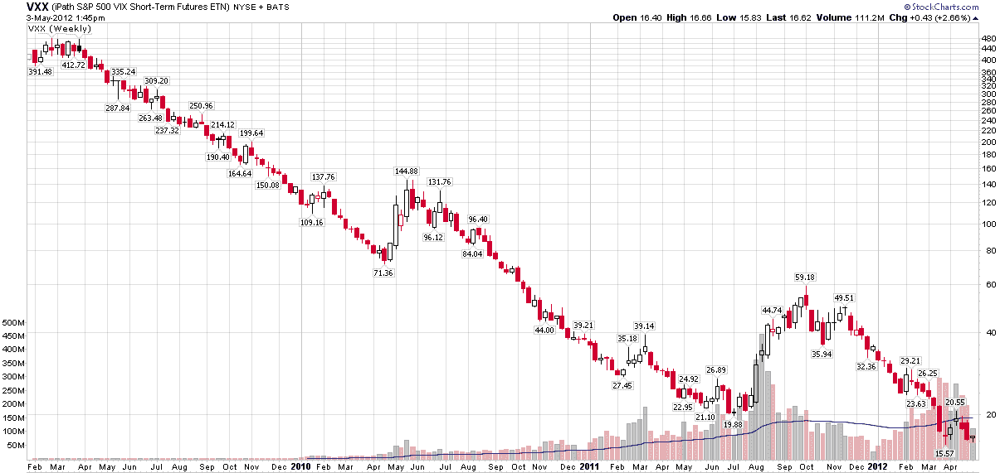

<!--yml

分类：未分类

日期：2024-05-18 16:31:08

-->

# VIX and More: 在巴伦的 The Striking Price 上的专栏作家：为什么我看空恐惧

> 来源：[`vixandmore.blogspot.com/2012/05/guest-columnist-at-striking-price-for.html#0001-01-01`](http://vixandmore.blogspot.com/2012/05/guest-columnist-at-striking-price-for.html#0001-01-01)

今天，我作为 Steven Sears 的代表，在[巴伦的](http://online.barrons.com/)*The Striking Price*上发表了专栏文章，提出了[当其他人恐惧时要贪婪](http://online.barrons.com/article/SB50001424053111903935304577382010847832798.html?mod=BOL_hps_highlight_bottom)的观点。

巴伦的文章是对我持空观点的一些快速总结，原因在于[恐惧](http://vixandmore.blogspot.com/search/label/fear)。本质上，我之所以看空恐惧，并不是因为我持有乐观的世界观，对[西班牙](http://vixandmore.blogspot.com/search/label/Spain)、[中国](http://vixandmore.blogspot.com/search/label/China)、[伊朗](http://vixandmore.blogspot.com/search/label/Iran)和其他全球热点事件不关心，而是因为恐惧几乎总是被高估——而且高估的幅度很大。在[波动率风险溢价](http://vixandmore.blogspot.com/search/label/volatility%20risk%20premium)和持续的负[滚动收益率](http://vixandmore.blogspot.com/search/label/roll%20yield)之间，长期 VIX 策略通常面临一场艰苦的战斗。

我在巴伦的文章中详细阐述了我的思考过程，但读者可以在下面的链接中找到一些类似的主题。

相关文章：

我的巴伦文章完整列表：

*[来源(s): StockCharts.com]*

***披露(s):*** *在撰写本文时持有 VXX 的空头头寸*
