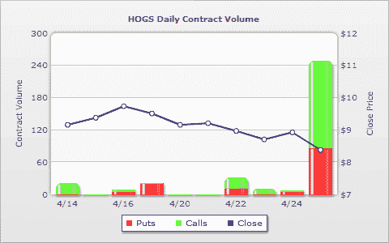

<!--yml

分类：未分类

date: 2024-05-18 17:50:17

-->

# VIX 和更多：HOGS 遭遇屠宰

> 来源：[`vixandmore.blogspot.com/2009/04/hogs-gets-slaughtered.html#0001-01-01`](http://vixandmore.blogspot.com/2009/04/hogs-gets-slaughtered.html#0001-01-01)

我对[猪流感](http://en.wikipedia.org/wiki/Swine_influenza)远远算不上是个专家，但根据我所听到的，没有证据表明猪流感可以通过食用猪肉产品传播。尽管如此，投资者并没有让这个事实阻止他们抛售中粮肉食（[HOGS](http://vixandmore.blogspot.com/search/label/HOGS)），这家市值 2.31 亿美元（市值）的中国猪肉和猪肉制品生产商。HOGS 昨日下跌 6.2%，成交量为自去年 7 月以来第二高，显然这是一个典型的连坐效应。

期权交易员们的反应却大相径庭。下图来自[WhatsTrading.com](http://whatstrading.com/)，显示尽管期权交易活动急剧上升，但大部分动作都在看涨期权上，其交易量是昨日看跌期权的两倍左右。另外，隐含波动率（未显示）也翻了一番多。

显然，猪流感周围存在很多不确定性——以及大量正在传播的错误信息。毫无疑问，食用猪肉产品与猪流感的传播无关，但这并不意味着猪肉产品和诸如中粮肉食这样的股票一定会被回避并遭受真正的跌幅。

*[source: WhatsTrading.com]*

***披露***：撰写本文时持有 HOGS.*
