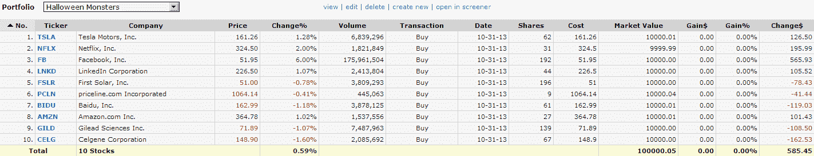

<!--yml

分类：未分类

date: 2024-05-18 16:12:31

-->

# VIX 和更多：万圣节怪物

> 来源：[`vixandmore.blogspot.com/2013/10/halloween-monsters.html#0001-01-01`](http://vixandmore.blogspot.com/2013/10/halloween-monsters.html#0001-01-01)

在今天这种氛围下，我没有资源和想象力去做一些像[Guillermo del Toro 沙发介绍](http://www.youtube.com/watch?v=CtgYY7dhTyE)那样精心制作的 2013 年恐怖屋 Treehouse 集锦（点击查看绝对值得）所以我决定建立一个我称之为[万圣节怪物](http://vixandmore.blogspot.com/search/label/Halloween%20Monsters)的组合——一个今年表现绝对出色的十只股票，带领市场走高。

以下是一些熟悉的动量股票名称：

我故意没有加入谷歌（GOOG），尽管它在 2013 年的表现非常出色，这主要是因为这个巨无霸现在市值达到了 3460 亿美元，对于一个规模如此之大的组织来说，增长速度肯定有所限制。

随着百度的加入，这个名单让我想起了 2007 年 10 月的时候我做的一件事，当时我觉得股市有点过于泡沫，于是创造了一个我称之为[OHFdex](http://vixandmore.blogspot.com/search/label/OHFdex)的东西，它最初是一个“过度成熟的高飞股票观察名单”，然后迅速演变成一个旨在追踪 14 只这类股票的指数。当市场转向下跌时，这个群体遭受了重创，其中一些股票如 CROCS([CROX](http://vixandmore.blogspot.com/search/label/CROX))、拉斯维加斯金沙([LVS](http://vixandmore.blogspot.com/search/label/LVS))、DryShips([DRYS](http://vixandmore.blogspot.com/search/label/DRY))等出现了[惊人的暴跌](http://vixandmore.blogspot.com/2008/10/ohfdex-one-year-later.html)。

当前的名单当然充满了高飞股票，但它们是否过度成熟或能够继续飙升并不像 2007 年 10 月那样明显——至少对我来说是这样。因此，我将密切关注万圣节怪物组合的未来表现，因为它们的走势可能会透露出 broader markets 即将何去何从。

*[来源(s): Finviz.com]*

至少，我希望这个名单上的股票能为本档案提供一些有趣的素材，正如 2007 年和 2008 年的 OHFdex 一样。谁知道呢，也许 OHFdex 的下一个版本就在拐角处。

关于 OHFdex 以及其他类似的幻想飞行，请查看下面的链接。

相关文章：

***披露(s):*** *无*
