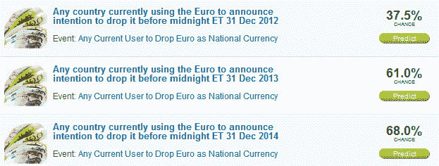
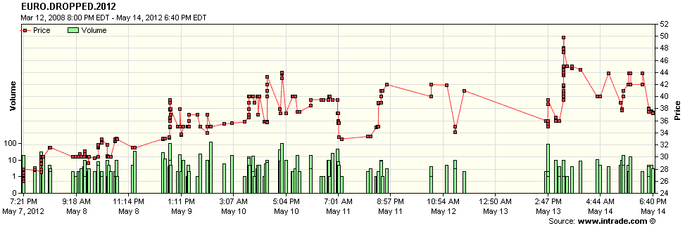

<!--yml

分类：未分类

日期：2024-05-18 16:30:32

-->

# VIX 和更多：评估希腊放弃欧元的机会

> 来源：[`vixandmore.blogspot.com/2012/05/handicapping-chances-of-greece-dropping.html#0001-01-01`](http://vixandmore.blogspot.com/2012/05/handicapping-chances-of-greece-dropping.html#0001-01-01)

理解[欧洲主权债务危机](http://vixandmore.blogspot.com/search/label/European%20sovereign%20debt%20crisis)的所有变动部分，即使是对于最有决心的分析师来说，也可能是一项艰巨的任务。毕竟，猜测明天危机的重点是什么，对于大多数投资者来说已经足够让他们应付了。

在[希腊](http://vixandmore.blogspot.com/search/label/Greece)的情况下，由于[不断变化的政党格局](http://ekloges.ypes.gr/v2012a/public/index.html#%7B%22cls%22:%22main%22,%22params%22:%7B%7D%7D)和打算进一步扭曲这一格局的善变选民，试图为各种情景分配概率，然后预测这对希腊与[欧元](http://vixandmore.blogspot.com/search/label/euro)关系的含义，对于许多投资者来说，足以让他们将自己的资金存入现金，直到未来稍微清晰一些。

对于欧元区的某些方面，有一些金融工具和措施可以作为衡量现在和未来可能情况的晴雨表。[信用违约互换](http://vixandmore.blogspot.com/search/label/credit%20default%20swaps)是一个极好的例子，还有[VSTOXX](http://vixandmore.blogspot.com/search/label/VSTOXX)股票波动指数，欧元波动指数([EVZ](http://vixandmore.blogspot.com/search/label/EVZ))，主权债务收益率等。

至于欧元，EVZ 目前相对平静。在其生命周期（始于 2007 年 11 月）中，EVZ 通常的交易价格略高于 VIX 的一半，今天它就是这样收盘的。尽管如此，VIX 今天达到了自 1 月份以来的最高收盘价，而 EVZ 在 1 月、2 月和 3 月初的波动要大得多。

就在这个时候，我发现自己更加关注各种[Intrade](http://vixandmore.blogspot.com/search/label/Intrade)预测市场合约。在欧元的情况下，Intrade 基于欧元区成员国宣布将停止使用欧元作为其国家货币的可能性，设有三个不同的合约。这三个合约的到期日期分别是 2012 年、2013 年和 2014 年，目前表明（见下图）到 2012 年底任何欧元区国家宣布将放弃欧元的机会是 37.5%，到 2013 年底是 61%，到 2014 年底是 68%。

除了来自这些预测市场合约价格的概率之外，趋势也值得关注。底部的图表显示了 2012 合约的交易情况。让我感到惊讶的是，希腊（或其他任何国家）会在今年退出欧元区的情绪似乎在昨天下午达到了顶峰（至少目前如此），并在今天的波动性交易中有所回调。对于那些希望[逐笔监控这个合约](https://data.intrade.com/graphing/jsp/timeAndSalesForm.jsp?contractId=713737&tradeURL=https://www.intrade.com)的人，可以尝试高级图表选项，并点击“时间和成交量”单选按钮。请注意，也可以为这个合约设置警报。

这似乎是一个很好的机会重申，我认为 Intrade 合约虽然有帮助，但远非完美。尽管如此，如果你的才能不包括在希腊语中进行四维欧元区多米诺骨牌游戏，这些预测合约可以作为一种简写，以确定某些事件可能如何发展。

相关文章：

**来源（s）：Intrade.com**

**披露（s）：** 无
