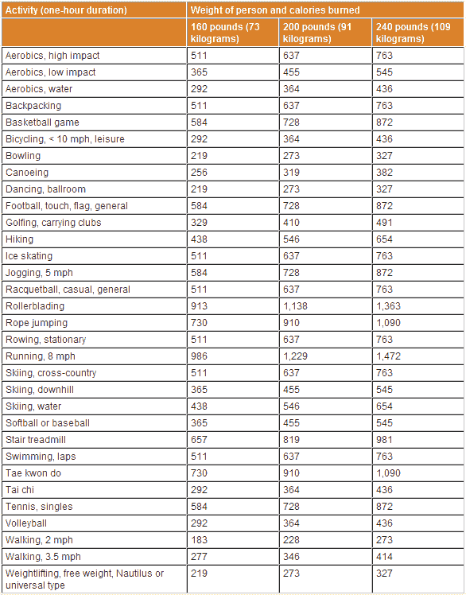

<!--yml

分类：未分类

日期：2024-05-18 18:13:41

-->

# VIX and More: Happy Thanksgiving to All

> 来自：[`vixandmore.blogspot.com/2008/11/happy-thanksgiving-to-all.html#0001-01-01`](http://vixandmore.blogspot.com/2008/11/happy-thanksgiving-to-all.html#0001-01-01)

当你吃完所有的火鸡、填料和南瓜派后，考虑做些运动。

下方的图表，由梅奥诊所提供，详细说明了需要多少运动才能消耗掉当天的美食过度：

来源：[梅奥诊所](http://vixandmore.blogspot.com/2008/11/happy-thanksgiving-to-all.html#0001-01-01)
