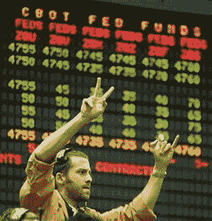

<!--yml

category: 未分类

日期：2024-05-18 19:05:03

-->

# VIX and More: Hedging Volatility with CME

> 来源：[`vixandmore.blogspot.com/2007/07/hedging-volatility-with-cme.html#0001-01-01`](http://vixandmore.blogspot.com/2007/07/hedging-volatility-with-cme.html#0001-01-01)

在 2 月 27 日波动性的大幅上涨之后，我建议[做多](http://vixandmore.blogspot.com/2007/03/long-volatility-with-exchanges.html)芝加哥商业交易所（CME），现在称为 CME 集团，在完成与 CBOT 的合并之后，作为一种后门[对冲](http://vixandmore.blogspot.com/search/label/hedging)手段，以防止波动性增加。

市场动荡了一周后，我注意到 Barron's 现在正在做出[类似的推荐](http://www.thestreet.com/_yahoo/newsanalysis/stockpickr/10370894.html?cm_ven=YAHOO&cm_cat=FREE&cm_ite=NA)，Business Week 已经描述了“[交易方式的巨大转变](http://www.businessweek.com/investor/content/jul2007/pi20070728_984403.htm?campaign_id=yhoo)”，而一则 AP 新闻证实了一个不断增长的乐队车[上周五](http://biz.yahoo.com/ap/070727/cme_group_mover.html?.v=1)，当 CME 以令人印象深刻的 19.00 点的涨幅收盘。

即使波动性回落到中等水平的十几位，我认为 CME 仍然是一个强有力的选择，[最近一季度的结果](http://biz.yahoo.com/rb/070724/cme_results.html?.v=1)支持了这一观点。然而，如果 VIX 在劳动节过后继续维持在 20 的水平之上，那么我认为 CME 可能会比当前市场上许多人预期的更大赢家。

当然，定期阅读的读者会很快回忆起来，预测一个月后的波动性可能会是一种[令人谦卑的经历](http://vixandmore.blogspot.com/2007/07/volatility-aces-bloggers.html)...
