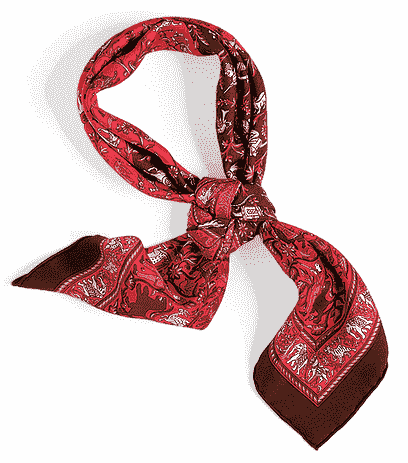
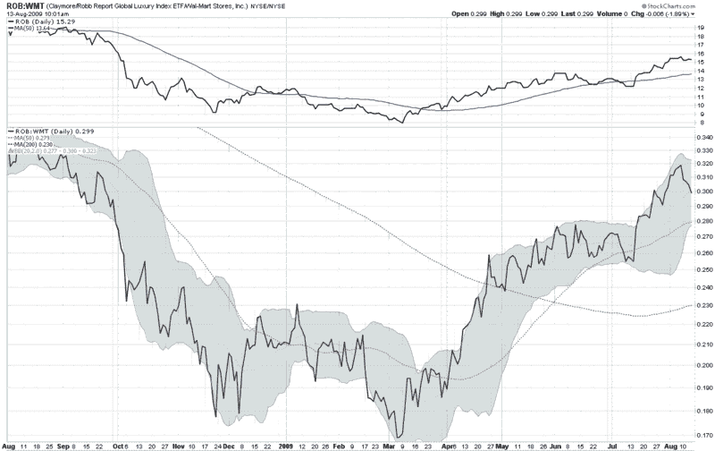

<!--yml

分类：未分类

日期：2024-05-18 17:34:01

-->

# VIX 和更多：爱马仕对比沃尔玛

> 来源：[`vixandmore.blogspot.com/2009/08/hermes-vs-wal-mart.html#0001-01-01`](http://vixandmore.blogspot.com/2009/08/hermes-vs-wal-mart.html#0001-01-01)

爱马仕对比沃尔玛（[WMT](http://vixandmore.blogspot.com/search/label/WMT)）；高端对比低端。在经济困难时期，这场斗争似乎并不公平。这家声望显赫的巴黎时尚屋，其客户从传统的王室成员到巴黎·希尔顿和麦当娜，与世界最大的零售商、总部位于阿肯色州本顿维尔的打折巨头对阵，后者的客户似乎在其他任何地方成名的机会都与在[杰里·斯波瑞格秀](http://en.wikipedia.org/wiki/The_Jerry_Springer_Show)上一样。

事实上，最近是爱马仕和[奢侈品](https://wiki.example.org/luxury)零售商如路易威登 Moet Hennessy 等一直在繁荣。上个月，爱马仕报告称第二季度[营收增长 12%](http://www.forbes.com/2009/07/21/hermes-lvmh-ppr-markets-equity-luxury.html?partner=yahootix)。今天，沃尔玛表示销售额下降了 1.4%，原因是“销售环境比我们预期的更为艰难。”

对于一些相关股票的现实检查，我在下面附上了来自 StockCharts.com 的比例图。该比例图追踪了 Claymore/Robb Report 全球奢侈品指数 ETF([ROB](http://vixandmore.blogspot.com/search/label/ROB))与沃尔玛的比例。ROB 的前十大持仓包括保时捷、戴姆勒([DAI](http://vixandmore.blogspot.com/search/label/DAI))、宝马、路易威登 Moet Hennessy、爱马仕、陆逊梯卡([LUX](http://vixandmore.blogspot.com/search/label/LUX))、保乐力加等。如图所示，自 3 月底以来，奢侈品板块的表现明显优于折扣零售商。

罗布（ROB）尚未在绝对基础上或与沃尔玛相比超过上周五的顶部。虽然从技术分析的角度来看，这一事实还不是值得注意的，但今后值得关注。

对于相关文章，读者可能想查阅：

来源：[StockCharts](https://wiki.example.org/stockcharts)
