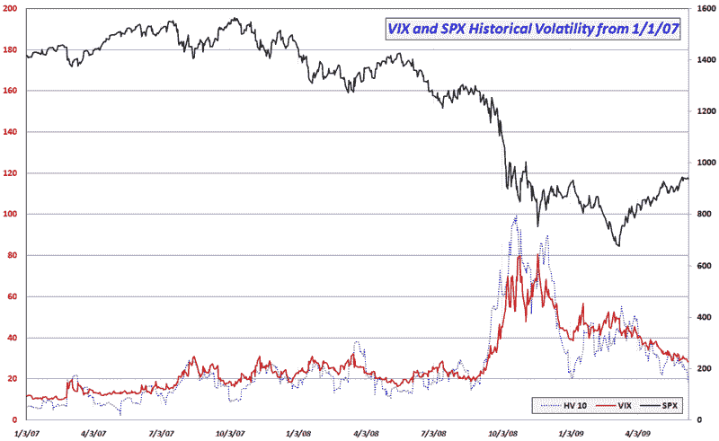

<!--yml

category: 未分类

date: 2024-05-18 17:43:34

-->

# VIX and More: Historical Volatility Continues to Plummet

> 来源：[`vixandmore.blogspot.com/2009/06/historical-volatility-continues-to.html#0001-01-01`](http://vixandmore.blogspot.com/2009/06/historical-volatility-continues-to.html#0001-01-01)

继今早开盘前的帖子之后，[在 VIX 达到雷曼低点时的波动率分析](http://vixandmore.blogspot.com/2009/06/volatility-in-context-with-vix-at-post.html)，今天 SPX 的 0.35%跌幅意味着标普 500 指数已经四个交易日没有超过 0.35%的波动了。

震荡交易对[历史波动率](http://vixandmore.blogspot.com/search/label/historical%20volatility)（HV）造成了沉重的打击，今天的行动将 SPX 的 10 日 HV 从 21.54 降至 18.10——这是自 2008 年 9 月 3 日以来的最低读数。

下面的图表试图将当前的历史波动率水平放入过去 2 年半的背景下。注意，当前的 10 日 HV 为 18.10，正好处于 2007 年（波动率非常低的一年）和 2008 年雷曼兄弟破产前期的这一测量范围内的中间。事实上，考虑到最近的历史记录，我会在至少一个月或两个月内看到 10 日 HV 降至当前水平以下感到非常惊讶。

当然，在没有波动率下降的情况下，VIX 可能会继续下跌，但最终历史波动率开始为 VIX 提供了一个底部，VIX 不太可能继续保持在下方。

在硬币的另一面，投资者也应该注意到，自 VIX 超过 35 的水平以来，已经过去了 26 个交易时段。如果有一个催化剂（比如[零售销售](http://vixandmore.blogspot.com/search/label/retail%20sales)数据、[房地产](http://vixandmore.blogspot.com/search/label/housing)信息、[工业生产](http://vixandmore.blogspot.com/search/label/industrial%20production)统计、国债拍卖结果、两周后的[FOMC](http://vixandmore.blogspot.com/search/label/FOMC)会议等）将改变波动率方程，那么将 35 作为 VIX 激增的目标是合理的，而不是 40 或 50。

最后，随着波动率预期的几乎每日缩小，那些可能对投机性购买 VIX 深度价外看涨期权感兴趣的人可能会发现它们比预期便宜得多——也许比一周或两周后的价格便宜得多。

*[图表：VIXandMore]*
