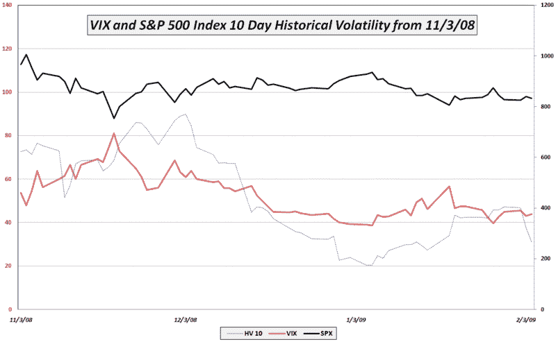

<!--yml

分类：未分类

日期：2024-05-18 18:01:31

-->

# VIX 和更多：历史波动率再次跌破 VIX

> 来源：[`vixandmore.blogspot.com/2009/02/historical-volatility-dropping-below.html#0001-01-01`](http://vixandmore.blogspot.com/2009/02/historical-volatility-dropping-below.html#0001-01-01)

确定 VIX 是否过高或过低的较好工具之一是将其与标普 500 指数近期[历史波动率](http://vixandmore.blogspot.com/search/label/historical%20volatility)水平进行比较。与以日历日为单位的 VIX 不同，历史波动率以交易日为单位，所以 21 天历史波动率的时间跨度与 VIX 计算中使用的 30 天大致相同。

大多数实践者似乎已经将 20 天历史波动率作为适当的近期回顾期标准化。为了预览 20 天 HV 的发展情况，我花了很多时间研究 10 天历史波动率。

下图显示了从 11 月初开始，标普 500 指数、VIX 以及标普 500 指数的 10 天历史波动率。注意自去年 12 月中旬以来，VIX 有 5 天例外，一直在 10 天 HV 之上，这一时期从 1 月 28 日延伸至 2 月 2 日。随着标普 500 指数在过去几天中的相对温和波动，标普 500 指数的 10 天 HV 再次大幅跌至 VIX 以下，昨日收盘价为 31.13。

除非波动性显著上升，否则我预计 VIX 将开始向 SPX 的 10 天 HV 方向移动，很可能会在下周初开始回到 30 年代长期停留。

*[source: VIX and More]*
