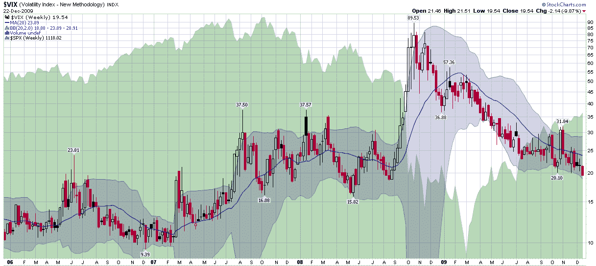

<!--yml

类别：未分类

日期：2024-05-18 17:19:24

-->

# VIX 和更多：历史波动率和季节性推动 VIX 跌破 20

> 来源：[`vixandmore.blogspot.com/2009/12/historical-volatility-and-seasonality.html#0001-01-01`](http://vixandmore.blogspot.com/2009/12/historical-volatility-and-seasonality.html#0001-01-01)

芝加哥期权交易所波动率指数（VIX）自 2008 年 8 月以来首次跌破 20.00，最终在今天收盘于 16 个月低点 19.54。

当我上周三在[《历史波动率指向 VIX 低于 20》](http://vixandmore.blogspot.com/2009/12/historical-volatility-pointing-to-sub.html)一文中提出 VIX 低于 20 的预测时，我的论点的核心是：“如果 HV（历史波动率）继续下降，那么 20 以上的 VIX 的支撑将会迅速恶化。大幅度的背离通常寿命较短。鉴于当前的背离已经达到六个交易日，VIX 只能暂时抵抗重力。”我进一步指出季节性因素（如[假期效应](http://vixandmore.blogspot.com/search/label/Holiday%20Effect)）正在起作用，并且我还受到了我所称的[日历回归](http://vixandmore.blogspot.com/search/label/calendar%20reversion)的鼓舞——VIX 在周五会因为市场制造商在周末调整价格以补偿五个交易日与七个日历周之间的不匹配，而额外下跌 1%左右。

然而，既然 VIX 已经收盘于 20 点以下，就没有理由假设它不会进一步下跌。即使不考虑这周后半段的三 ½个交易日和下周的四天交易周的季节性因素，当前的历史波动率数据也表明 VIX 的合理价值在 17 mid-points 左右。

虽然我认为投资者还需要一段时间才能接受 VIX 距离 20 点以上还有很长的路要走，但今天应该有助于减轻这样的呼声：即 VIX 达到 20 点就已经足够低，足以引发股市抛售。

关于相关主题的更多信息，读者可以查阅：

*[来源：StockCharts]*

***披露：*** 无
