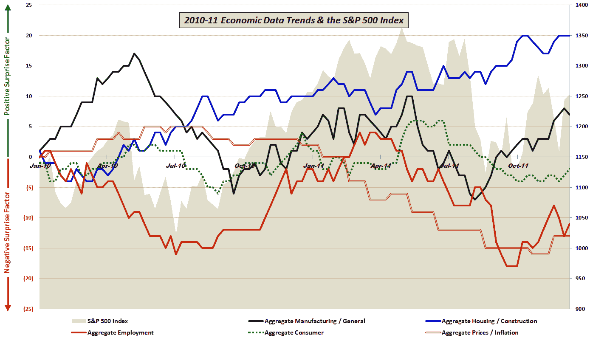

<!--yml

类别：未分类

日期：2024-05-18 16:46:34

-->

# VIX 和更多：美国数据最近表现如何？

> 来源：[`vixandmore.blogspot.com/2011/12/how-good-has-us-data-been-lately.html#0001-01-01`](http://vixandmore.blogspot.com/2011/12/how-good-has-us-data-been-lately.html#0001-01-01)

在某个时点，投资者们将不得不把他们的手表从中欧时间调回东部时间（如果你是期权交易员的话则是中部时间）并更加关注那个常常被忽视的位于加拿大南部的国家内部正在发生的事情。

无论何时那一刻到来，大多数投资者心中日程上的第一个问题将是相对强劲的经济表现（至少按当前全球标准来看）是否能够持续。本周早些时候，在[全球制造业衰退还是噪音？](http://econompicdata.blogspot.com/2011/12/global-manufacturing-recession.html)中，EconPic 提出了一个问题，即美国和其他几个新兴市场经济体是否能够带动全球经济复苏，还是欧洲和太平洋沿岸国家最终会将那些目前繁荣的经济体拖垮。

我此刻对这个问题的答案还不清楚，但我确实相信答案很可能会来自于美国经济表现相对于预期的表现，这我已经在过去两年中详细跟踪了。下面的图表显示了自 2010 年初以来，美国在五个群体（制造业/综合、住房/建筑、就业、消费者和价格/通胀）相对于预期的情况。

下面的图表显示，在过去 2-4 个月里，所有类别中的积极惊喜确实有所上升。如果这些趋势持续下去，这对全球活动和股价来说都是好兆头——尤其是如果欧洲灾难折扣能够被削减的话。

对这个图表中包含的经济数据细节和所使用的方法感兴趣的读者，建议查看下面的链接。对于那些想要了解更多关于构成我聚合数据计算的具体经济数据发布信息的人，请查看[图表周报：经济数据年历（2010 年）](http://vixandmore.blogspot.com/2011/01/chart-of-week-year-in-economic-data.html)。

相关文章：

**披露：** *无*

*[数据来源：多样]*
