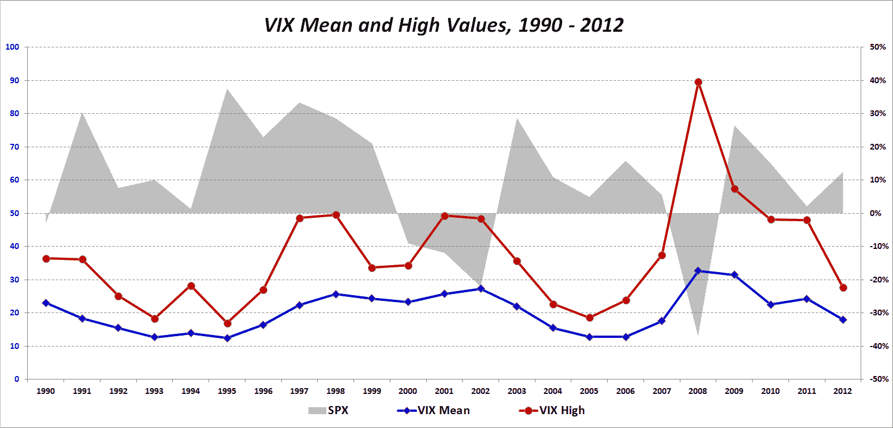

<!--yml

分类：未分类

日期：2024-05-18 16:23:48

-->

# VIX 和更多：VIX 可能会激增多少？

> 来源：[`vixandmore.blogspot.com/2012/11/how-high-might-vix-spike.html#0001-01-01`](http://vixandmore.blogspot.com/2012/11/how-high-might-vix-spike.html#0001-01-01)

考虑到欧元区所有的戏剧性事件，更不用说[财政悬崖](http://vixandmore.blogspot.com/search/label/fiscal%20cliff)的各种困难，[中国](http://vixandmore.blogspot.com/search/label/China)的持续动荡，中东和北非的不稳定等等，今年标普尔 500 波动率指数（VIX）的交易价未能超过 30.00，这实在是让人惊讶。

事实上，如果一年内 VIX 的最大值仅为 27.73，2012 年可能是 15 年来（如果排除 2004-2006 年的大格林斯潘流动性泡沫）VIX 首次未能突破 20 年代。

27.73 作为 VIX 的年份高点如何？自 1990 年以来，VIX 的平均高点为 37.90（2008 年高点的 89.53 有所膨胀），而中位数高点 VIX 仍然相当高，为 35.93。

这并不是说市场在 2012 年的大部分时间里对 SPX 期权（以及因此对 VIX）进行了误定价，只是为了指出欧洲主权债务危机（[`vixandmore.blogspot.com/search/label/European%20sovereign%20debt%20crisis`](http://vixandmore.blogspot.com/search/label/European%20sovereign%20debt%20crisis)）和财政悬崖戏剧肯定还有许多章节尚未展开，其中一些将在年底前展开。

这可能是那些 VIX 从未达到 30 年代的年份之一，但如果确实如此，它将在过程中克服相当高的赔率。

相关文章：

来源：[CBOE, Yahoo]

***披露：*** *无*
