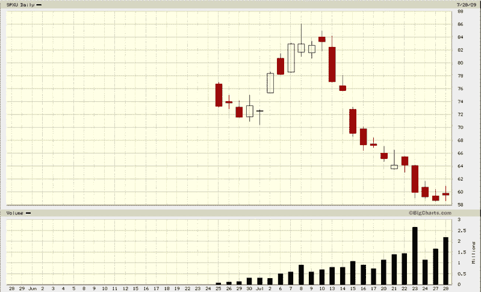

<!--yml

分类：未分类

日期：2024-05-18 17:36:29

-->

# VIX 和更多：SPXU 和 UPRO 是如何被交易的？

> 来源：[`vixandmore.blogspot.com/2009/07/how-are-spxu-and-upro-being-traded.html#0001-01-01`](http://vixandmore.blogspot.com/2009/07/how-are-spxu-and-upro-being-traded.html#0001-01-01)

昨天，我在[《SPXU 是否通过增加使用而人为地压低了 VIX？》](http://vixandmore.blogspot.com/2009/07/is-vix-being-artificially-depressed-by.html)一文中尽可能地提出了挑衅性的观点。我提到的其中一个观点是[SPXU](http://vixandmore.blogspot.com/search/label/SPXU) 可以用作 SPX 看跌期权的替代品（可能导致 VIX 因此而被人为压低），对于那些寻求利用杠杆 ETF 作为可能的投资组合[对冲](http://vixandmore.blogspot.com/search/label/hedging)的人来说。坦白说，我不相信 SPXU（或任何[三倍 ETF](http://vixandmore.blogspot.com/search/label/triple%20ETFs)）作为投资组合对冲工具会有大量需求，这主要是因为复合效应的问题（更多详情请参见[了解市场暴露变化对杠杆 ETF 影响的报告](http://www.direxionshares.com/pdfs/Compounding_Article_ETFs.pdf)来自[Direxion](http://vixandmore.blogspot.com/search/label/Direxion)）。

实际上，当我预测 SPXU 和其对应产品[UPRO](http://vixandmore.blogspot.com/search/label/UPRO) 在它们一个月前刚刚推出时的美好前景时[《下一个大事件？》](http://vixandmore.blogspot.com/2009/06/next-big-thing.html)，我设想了这些三倍 ETF 的三个主要用途：

1.  作为一种具有特定强调的投机性短期交易工具，特别是日内交易

1.  作为各种配对交易计划的一部分

1.  作为所有大型且不断增长的 SPX 衍生品家族（期货、期权、ETF、杠杆 ETF 等）所提供的许多套利机会的一部分

虽然我没有将 SPXU 视为一个可行的对冲工具，这主要是因为我考虑的是对冲的更长周期。如果 SPX 看跌期权可以以一个月期权的周期为单位进行分批利用，那么在月度时间框架内与 SPXU 竞争将处于不利地位。然而，我相信 SPXU 不仅仅可以作为一个交易 session 或偶尔的两日序列的有效对冲，正如许多人所建议的那样。根据波动性水平，SPXU 对冲可以保持三天以上，由于复合效应导致损失的风险最小。在我看来，只有当持有期限开始超过四天时，SPXU 对冲才会开始变得低效。

由于 SPXU 已经在我打这些字时交易了 230 万股，这个产品的成功现在已经确定。尽管 SPXU 作为对冲工具的价值与其它可能的用途相比相形见绌，但我认为 SPXU 可以作为 2-3 天周期内的有效对冲，并可接受程度的复合风险。

*[来源：BigCharts]*

**声明**：在撰写本文时，作者持有大量**SPXU**长期投资。
