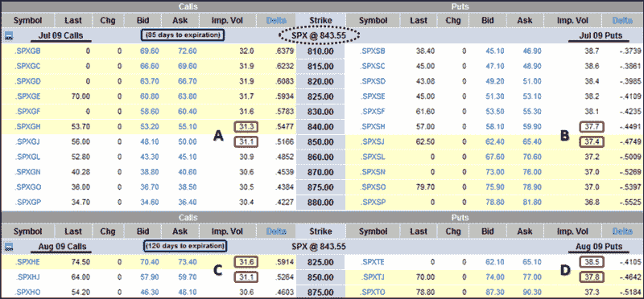

<!--yml

类别：未分类

date: 2024-05-18 17:50:52

-->

# VIX and More: How to Create Your Own Portable VXV

> 来源：[`vixandmore.blogspot.com/2009/04/how-to-create-your-own-portable-vxv.html#0001-01-01`](http://vixandmore.blogspot.com/2009/04/how-to-create-your-own-portable-vxv.html#0001-01-01)

我最近收到了一位读者的来信，他想要创建一个自制的 VXV 版本，可以应用于 Nifty（正式称为[S&P CNX Nifty](http://www.nseindia.com/content/indices/ind_nifty.htm)），这是一个在[印度国家证券交易所](http://www.nseindia.com/homepage.htm)上的 50 家大型市值公司的指数。具体来说，读者想知道是否可以使用[印度 VIX](http://vixandmore.blogspot.com/search/label/India%20VIX)的 93 天移动平均值来创建一个类似于 VXV 的指数。

实际上，VXV 忽略了所有历史波动率读数，转而使用隐含波动率。它是由离未来 93 天最近的月份的期权隐含波动率的混合而成。

参考下面的图表，我将创建一个“快速简便”版本的 VXV，可以用于任何有期权的底层资产。这里的示例是针对 SPX 的，但对于任何底层资产都可以得到一个 VXV 代理。

步骤如下：

1.  确定两个到期时间最接近 93 天的期权到期月份（VXV 的期限）。在此例中，我们使用七月，到期时间为 85 天，以及八月，到期时间为 120 天。当然，每个月都有一次到期时间为恰好 93 天。

1.  确定 SPX 的最后收盘价以及紧邻最后收盘价上下的系列收盘价，分别为两个月的数据。在这里，最后收盘价为 843.55。对于七月，计算使用的系列为 840 和 850。对于八月，我们使用 825 和 850。

1.  为每个两个月份的相关系列确定看涨和看跌期权的隐含波动率水平。这些在下面的 optionsXpress 图表中以红色突出显示。

1.  从两个七月的看涨期权（A）、看跌期权（B）、八月看涨期权（C）和看跌期权（D）中插值计算 SPX 收盘价的隐含波动率。在此例中，插值是通过假设 SPX 收盘价的比例与隐含波动率值的比例相同来完成的。例如：

    A = 31.1 + (6.45/10)*(31.3-31.1)

    A = 31.229

1.  现在我们已经有了 SPX 收盘价的隐含波动率水平，我们需要对这些数据在每个月份的看涨和看跌期权中进行平均。七月=(A+B)/2，八月=(C+D)/2

1.  最后，从上述步骤中插值 July 和 August 的结果，以估计 93 天的隐含波动率。最简单的方法是先从最近的一个月开始，然后加上适当的后一个月的分数部分，使得混合平均值达到 93。这种方法与上述插值类似，得到的方程看起来像这样：

    VXV = [(A + B) / 2] + [(93-85)/(120-85) * ((C + D) / 2) – ((A + B) / 2)]

这不是 CBOE 所使用的方法，CBOE 的方法更为复杂，具体细节请参阅[CBOE S&P 500 3-Month Volatility Index Description](http://www.cboe.com/micro/vxv/3monthvix.pdf)。这种快速而简略的变体可以快速计算，并且可以跨任何有期权的基础资产移植，包括 Nifty。

来源：[optionsXpress]
